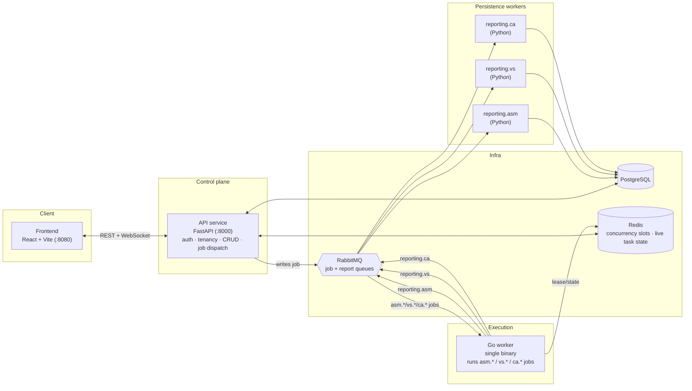
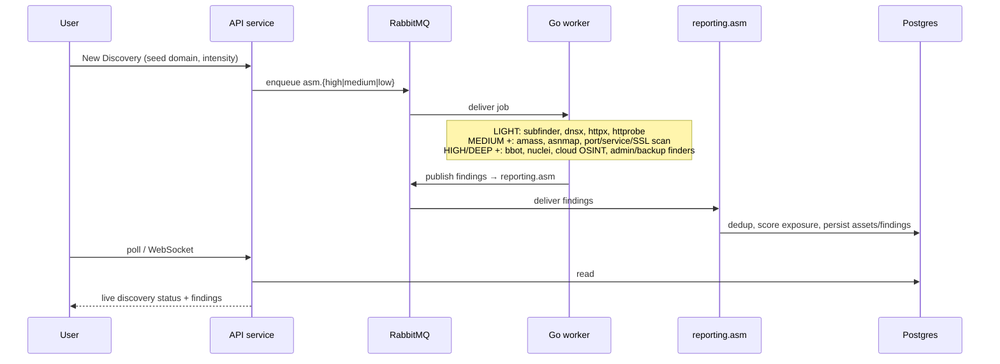
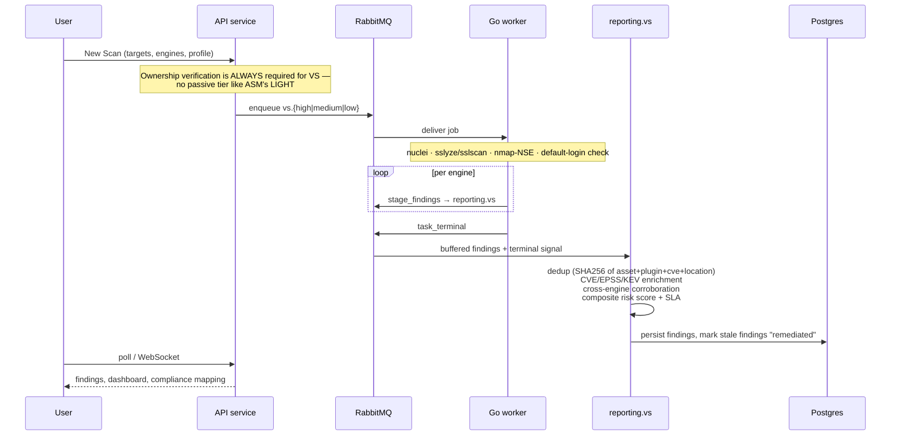
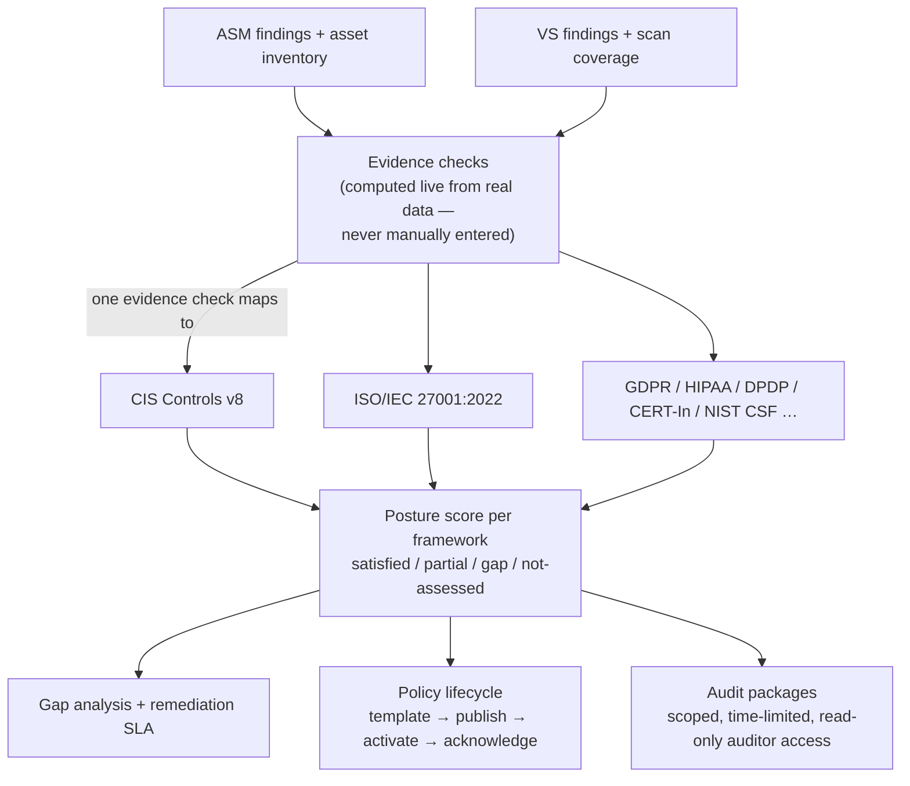

<p align="center">
  
</p>

<h1 align="center">CyberSentinel</h1>

<p align="center">
  <b>Attack Surface Management · Vulnerability Scanning · Compliance & Audit — in one self-hostable platform.</b>
</p>

<p align="center">
  <a href="#quick-start"></a>
  <a href="#tech-stack"></a>
  <a href="#tech-stack"></a>
  <a href="LICENSE"></a>
  <a href=".github/workflows/ci.yml"></a>
</p>

<p align="center">
  Discover every internet-facing asset you own, find and prioritize the vulnerabilities in them, and turn that
  same evidence into compliance posture — automatically, continuously, without duct-taping three separate tools together.
</p>

---

## Contents

- [What is CyberSentinel](#what-is-cybersentinel)
- [Modules](#modules)
- [Architecture](#architecture)
- [How each module actually works](#how-each-module-actually-works)
  - [Attack Surface Management (ASM)](#attack-surface-management-asm)
  - [Vulnerability Scanning (VS)](#vulnerability-scanning-vs)
  - [Compliance & Audit (CA)](#compliance--audit-ca)
- [Tech stack](#tech-stack)
- [Quick start](#quick-start)
- [Environment variables](#environment-variables)
- [Project structure](#project-structure)
- [Testing](#testing)
- [Deployment](#deployment)
- [Self-hosting vs. managed cloud](#self-hosting-vs-managed-cloud)
- [Documentation](#documentation)
- [License](#license)

---

## What is CyberSentinel

CyberSentinel is a multi-tenant security platform that answers three questions about your organization
continuously, not once a year:

1. **What do we actually expose to the internet?** (Attack Surface Management)
2. **Which of those exposures are actually exploitable, and how bad?** (Vulnerability Scanning)
3. **Are we provably compliant with the frameworks we're on the hook for — using the evidence we already collected?** (Compliance & Audit)

The three modules share one asset inventory and one evidence pipeline, so a scan you already ran for
vulnerability management also satisfies compliance controls — you don't collect the same evidence three times
for three different tools.

It's a normal web app you run yourself: a Postgres database, a message queue, a couple of background workers,
an API, and a frontend. No proprietary agents, no phone-home telemetry, no vendor lock-in.

## Modules

| Module | Status | What it does |
|---|---|---|
| **ASM** — Attack Surface Management | Live | Continuous discovery of domains, subdomains, IPs, cloud assets, repos, SaaS apps, and exposed credentials. Scores your exposure and tells you what changed. |
| **VS** — Vulnerability Scanning | Live | Multi-engine vulnerability scanning (`nuclei`, TLS/SSL analysis, port/service fingerprinting, default-credential checks) with CVE/EPSS/KEV enrichment and SLA-tracked remediation. |
| **CA** — Compliance & Audit | Live | Maps evidence from ASM/VS scans onto real compliance frameworks (CIS, ISO 27001, GDPR, HIPAA, DPDP, CERT-In, NIST CSF, …), tracks gaps, manages policies, and issues scoped read-only access for external auditors. |
| Breach & Attack Simulation, Threat Intelligence, Incident Response | Planned | Not built yet — the module framework (see [Architecture](#architecture)) is designed for these to slot in without touching ASM/VS/CA code. |

## Architecture

Everything is job-queue driven: the API never runs a scan itself — it writes a job, and a worker picks it up.
This keeps the request path fast and lets scan execution scale independently of the web tier.



**Why split execution from reporting?** The Go worker's only job is running scan tools as fast as possible —
it doesn't know about dedup, scoring, or SLA logic. The Python reporting consumers own all of that, so scoring
rules can change without touching (or redeploying) the thing actually running `nuclei`. Same reason `worker`
is one Go binary instead of three: the tools it shells out to (`subfinder`, `nuclei`, `nmap`, …) are identical
infrastructure regardless of which module dispatched the job.

Auth is self-hosted: bcrypt-hashed passwords + self-issued JWTs (access + refresh token pair), with optional
Google/GitHub OAuth. No external identity provider is required to run this.

## How each module actually works

### Attack Surface Management (ASM)



- **Intensity tiers gate which tools run** — `LIGHT` is passive-only (no ownership check needed). `MEDIUM`/`HIGH`/`DEEP` run active techniques and require the asset to pass **ownership verification** first (a DNS TXT-record challenge for domains) — the platform won't actively scan something you haven't proven you own.
- Discovered subdomains, IPs, cloud assets, repos, SaaS apps, and exposed credentials all land in the same **Asset Inventory**, each contributing to a composite **Attack Surface Score**.
- Key code: `worker/services/asm.go` + `worker/tools/` (engines), `backend/reporting/asm/` (persistence + scoring), `backend/api_service/routes/asm.py`.

### Vulnerability Scanning (VS)



- Findings are enriched with **CVSS**, **EPSS** (exploit-prediction score), and **CISA KEV** (known-exploited) status, then rolled into a composite risk score used for SLA due-dates.
- A finding that stops being re-detected across scans is automatically transitioned to `remediated` — no one has to close tickets by hand.
- Key code: `worker/services/vs.go` + `worker/tools/vs_engines.go`, `backend/reporting/vs/ingest.py` (dedup + scoring), `backend/api_service/routes/vs.py`, `backend/api_service/scoring/vs_compliance.py`.

### Compliance & Audit (CA)



- **"Evidence collected once, applied across frameworks"** is literal: a single evidence check (e.g. "critical
  findings older than 30 days = 0") can satisfy the equivalent control in CIS, ISO 27001, NIST CSF, and others
  simultaneously — you don't re-answer the same question per framework.
- **Policies** are versioned: publishing a new version resets member acknowledgment, so "everyone has read the
  current policy" is always a real, current fact, not a one-time checkbox.
- **Audits** package the relevant evidence for a framework into a scoped bundle and issue an external auditor a
  time-limited, read-only access token (shown once, stored only as a hash) — auditors sign in at a separate
  `/auditor` portal, no account on the main platform needed.
- Key code: `backend/api_service/routes/ca.py`, `backend/api_service/scoring/` (framework/control mapping),
  `frontend/src/components/ca/`.

## Tech stack

| Layer | Technology |
|---|---|
| Frontend | React 18 + TypeScript + Vite, Tailwind CSS, shadcn/ui, TanStack Query |
| API service | Python 3.11, FastAPI, SQLAlchemy (async) + Alembic, self-issued JWT auth |
| Scan-execution worker | Go 1.24 (single binary, runs all three modules' scan jobs) |
| Reporting/persistence | Python consumers (`backend/reporting/{asm,vs,ca}`) |
| Data stores | PostgreSQL 16, Redis 7, RabbitMQ 3.13 |
| Realtime | WebSocket (live scan/task status to the browser) |

## Quick start

### Prerequisites

| Tool | Version | Needed for |
|---|---|---|
| Docker + Docker Compose | recent | Everything, if you take the all-in-Docker path |
| Python | 3.11 | API service + reporting consumers (hybrid path) |
| Go | 1.24 | Scan-execution worker (hybrid path) |
| Node.js | 20 | Frontend (hybrid path) |

Real scans additionally need the underlying CLI tools on `PATH` (`subfinder`, `nuclei`, `nmap`, etc. — see
[docs/03_local_setup_guide.md §1](docs/03_local_setup_guide.md#1-prerequisites) for the full list by intensity
tier). Without them, the app runs fine — scans just won't find anything.

### 1. Clone and configure

```bash
git clone https://github.com/pankajneema/cyberSentinel.git
cd cyberSentinel

cp backend/api_service/.env.example backend/api_service/.env
cp worker/.env.example worker/.env
cp frontend/.env.example frontend/.env
```

Generate a real `JWT_SECRET` and put it in `backend/api_service/.env` — this is the one required secret; the
API refuses to boot without it:

```bash
python3 -c "import secrets; print(secrets.token_urlsafe(48))"
```

### 2. Run it — pick one

**All in Docker** (fastest, closest to production):

```bash
make up          # build + start everything
make logs        # tail all services
make down        # stop
```

**Hybrid** (infra in Docker, app services on your host with hot-reload — best for active development):

```bash
make install      # one-time: Python venv + deps, frontend deps
make dev          # infra in Docker + api + worker + reporting + frontend, all with reload
```

Either way, once it's up:

```bash
make migrate                          # apply the DB schema (Docker path does this automatically)
curl http://localhost:8000/health     # → 200
open  http://localhost:8080           # sign up and you're in — first signup becomes the org owner
```

Run `make help` for every available command (tests, lint, individual services, DB helpers).

## Environment variables

Full variable list with descriptions lives in each service's `.env.example`
([`backend/api_service/.env.example`](backend/api_service/.env.example),
[`worker/.env.example`](worker/.env.example), [`frontend/.env.example`](frontend/.env.example)) — copy, don't
guess. The short version:

| Variable | Where | Required? |
|---|---|---|
| `DATABASE_URL` | API + worker | Yes |
| `JWT_SECRET` | API | **Yes — no default, fails fast if unset** |
| `REDIS_URL` / `RABBITMQ_URL` | API + worker | Yes |
| `CONTROL_PLANE_TOKEN` | API + worker | Yes — must match on both sides (internal worker→API auth) |
| `VS_CRED_KEY` | API | Yes — encrypts stored scan credentials at rest |
| `GOOGLE_CLIENT_ID`/`SECRET`, `GITHUB_CLIENT_ID`/`SECRET` | API | No — that OAuth button just returns a clean 503 until set; email/password auth always works |
| `VITE_API_URL` | Frontend | Yes — where the SPA finds the API |

## Project structure

```
cyberSentinel/
├── frontend/                  React + TypeScript SPA
├── backend/
│   ├── api_service/           FastAPI control plane — auth, tenancy, CRUD, job dispatch
│   │   ├── routes/            One router per resource (asm.py, vs.py, ca.py, auth.py, …)
│   │   ├── models/            SQLAlchemy models
│   │   ├── scoring/           Risk scoring + compliance framework mapping
│   │   └── migrations/        Alembic migrations (schema source of truth)
│   ├── reporting/             Persistence workers: asm/, vs/, ca/ — one RabbitMQ consumer each
│   └── notificationservice/   In-app + email notification dispatch
├── worker/                    Go scan-execution engine (single binary, all modules)
│   ├── services/               Per-module orchestration (asm.go, vs.go, ca.go)
│   └── tools/                  Individual scan-tool adapters
├── docs/                      Deep per-service architecture, API reference, DB guide
├── infrastructure/            Kubernetes manifests + Terraform
├── scripts/dev.sh             Run every app service locally with prefixed logs
└── docker-compose.yml         Full stack, one command
```

## Testing

```bash
make test            # backend pytest + go test
make test-backend    # FastAPI test suite only
make go-test         # Go worker test suite only
make fe-typecheck    # frontend type-check — this is the actual CI correctness gate
```

The frontend has no separate test suite; `tsc --noEmit` + a successful build is its gate, matching
[`.github/workflows/ci.yml`](.github/workflows/ci.yml). CI also runs a secret scan (gitleaks), SAST (Semgrep),
dependency audit (pip-audit / npm audit), and a container vulnerability scan (Trivy) on every push.

## Deployment

`infrastructure/` has Kubernetes manifests and Terraform for a production-style deployment; `docker-compose.yml`
is the reference for what needs to run and how the services connect. See
[docs/04_infra_and_api_guide/infra.md](docs/04_infra_and_api_guide/infra.md) for the full deploy guide
(scaling, secrets management, CI/CD).

## Self-hosting vs. managed cloud

CyberSentinel is built to be genuinely self-hostable — every service in this repo is what actually runs, there's
no hidden SaaS dependency you can't replace, and running it yourself doesn't put you on a crippled tier. If you'd
rather not run Postgres/RabbitMQ/workers yourself, a managed cloud version is planned for teams who want the
infra, scaling, upgrades, and support handled for them. This repository is the self-hosted path.

## Documentation

This README is the front door. For depth, [`docs/`](docs/README.md) has five guides: repository inventory,
per-service developer guide, a glossary + on-screen field reference, a from-scratch local setup walkthrough, and
an infra/API reference — see [docs/README.md](docs/README.md) for the full index.

## License

[Functional Source License 1.1, MIT Future License](LICENSE) (FSL-1.1-MIT) — the same model
[Sentry](https://fsl.software) uses. In plain terms:

- **Free** to self-host, use, modify, and redistribute — for internal use, research, education, or building on
  top of it — for anyone, including commercially.
- **Not permitted:** repackaging CyberSentinel (or a derivative) itself as a competing hosted/managed product
  or service you sell to others.
- **Two years after each release**, that version automatically becomes available under the plain, unrestricted
  MIT license — no action needed on anyone's part.

This is exactly the free-to-self-host / commercial-hosting-reserved split described above.

---

<p align="center">Built by <a href="https://www.curiousdevs.com">CuriousDevs </a>.</p>
