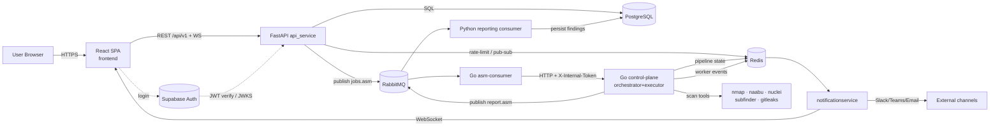

# 00 — Repository Inventory (Phase 0)

> **Purpose.** This is the *backbone* document for all CyberSentinel documentation. Every other guide references it instead of re-deriving facts. It is a factual map of what exists in the repository today — services, dependencies, APIs, and data stores — reverse-engineered from the actual code, not assumptions. Ambiguities are tagged `[NEEDS CONFIRMATION FROM DEV]`.
>
> **Last generated:** 2026-07-04 · **Product stage:** Attack Surface Management (ASM) live; other modules coming.

**Related docs:** [Master Index](README.md) · [Developer Guide](01_developer_guide/overview.md) · [Glossary & Panels](02_glossary_and_panel_guide/domain_glossary.md) · [Local Setup](03_local_setup_guide.md) · [Infra & API](04_infra_and_api_guide/infra.md) · [Database](05_database_guide.md)

---

## Table of Contents
1. [What CyberSentinel Is](#1-what-cybersentinel-is)
2. [Top-Level Services & Directories](#2-top-level-services--directories)
3. [External Dependencies & Tooling](#3-external-dependencies--tooling)
4. [API Surface (by service)](#4-api-surface-by-service)
5. [Data Stores](#5-data-stores)
6. [Cross-Cutting Concerns](#6-cross-cutting-concerns)
7. [Open Questions / Confirmation Needed](#7-open-questions--confirmation-needed)

---

## 1. What CyberSentinel Is

CyberSentinel is a **multi-tenant SaaS security platform**. Its first shipped module is **Attack Surface Management (ASM)**: it discovers an organization's internet-facing assets (domains, subdomains, IPs, cloud resources, code repositories, SaaS apps, exposed user accounts), actively scans them (DNS, ports, services, TLS, secrets, breach leaks), and produces an **explainable, per-asset exposure score**.

The platform is deliberately built as a **module framework**: ASM is the reference module, and additional modules — **Vulnerability Scanning (VS)** (partially built, in-memory), Threat Intelligence, Breach & Attack Simulation, Incident Response, Compliance & Audit — slot into the same identity, tenancy, scheduling, and notification plumbing without restructuring.

**Architectural shape:** a React SPA talks to a Python **FastAPI** API. The API persists to **PostgreSQL** and dispatches scan jobs onto **RabbitMQ**. A fleet of **Go workers** consumes jobs, runs real security tooling (nmap, naabu, nuclei, subfinder, gitleaks, …), and publishes results. A Python **reporting** consumer persists those results back into Postgres. A **notification service** fans out realtime + multi-channel alerts over Redis pub/sub and WebSockets. Identity is delegated entirely to **Supabase**.

---

## 2. Top-Level Services & Directories

| Path | Language / Stack | Role | Deep guide |
|---|---|---|---|
| `frontend/` | React 18 + TypeScript + Vite 5 + Tailwind/shadcn | Single-page app; all user-facing UI | [frontend.md](01_developer_guide/frontend.md) |
| `backend/api_service/` | Python 3.11 + FastAPI 0.104 + async SQLAlchemy 2 | Core REST/WebSocket API, tenancy, scheduling, RBAC | [api_service.md](01_developer_guide/api_service.md) |
| `backend/workers/` | Go 1.24 | Distributed scan pipeline: `asm-consumer` + `control-plane` binaries | [workers.md](01_developer_guide/workers.md) |
| `backend/reporting/` | Python 3.11 | RabbitMQ consumer that persists worker scan results into Postgres | [reporting.md](01_developer_guide/reporting.md) |
| `backend/notificationservice/` | Python 3.11 | Realtime (WebSocket) + Slack/Teams/Email fan-out over Redis pub/sub | [notificationservice.md](01_developer_guide/notificationservice.md) |
| `infrastructure/kubernetes/` | K8s manifests | Cluster deployment | [infra.md](04_infra_and_api_guide/infra.md) |
| `infrastructure/terraform/` | Terraform | Cloud resource provisioning | [infra.md](04_infra_and_api_guide/infra.md) |
| `.github/workflows/` | GitHub Actions | CI (lint/test/build per service) | [infra.md](04_infra_and_api_guide/infra.md) |
| `startup/`, `dev.sh`, `Makefile`, `docker-compose.yml` | Shell / Compose | Local dev orchestration | [Local Setup](03_local_setup_guide.md) |
| `docs/` | Markdown | This documentation set | — |

> **Note:** `backend/notificationservice/` is imported by `api_service` at runtime (its parent `backend/` is prepended to `sys.path`), so the notification bus runs *inside* the API process, not as a separate deployed container. See [notificationservice.md](01_developer_guide/notificationservice.md).

---

## 3. External Dependencies & Tooling

### Data / infrastructure services (from `docker-compose.yml`)
| Service | Image | Purpose |
|---|---|---|
| PostgreSQL | `postgres:16-alpine` | System of record for all application data |
| Redis | `redis:7-alpine` | Rate-limit windows, realtime pub/sub, scan-pipeline state, dedup locks |
| RabbitMQ | `rabbitmq:3.13-management-alpine` | Job transport (`jobs.asm`) and result transport (`report.asm`) |
| Supabase | external SaaS | Identity provider (auth, JWT issuance, OAuth) |
| ClickHouse | driver wired, **not yet used** | Reserved for future analytical/time-series data `[NEEDS CONFIRMATION FROM DEV]` |

### Backend Python (`backend/api_service/requirements.txt`) — grouped
- **Web/API:** fastapi 0.104.1, uvicorn[standard] 0.24.0, pydantic[email] 2.5.0, python-multipart
- **Auth/crypto:** python-jose[cryptography] 3.3.0, PyJWT 2.10.1, passlib[bcrypt] 1.7.4, bcrypt 3.2.2 *(legacy password path)*
- **DB/ORM:** sqlalchemy 2.0.23, asyncpg, psycopg2-binary 2.9.9, alembic
- **Redis:** redis 5.0.1 · **RabbitMQ:** pika 1.3.2, aio_pika
- **ClickHouse:** clickhouse-driver 0.2.6, clickhouse_connect *(wired, unused)*
- **Config/util:** python-decouple 3.8, dotenv, httpx, croniter 2.0.5
- **Reporting:** reportlab 4.2.2 (PDF)
- ⚠️ Packaging debt: `dotenv` entry should be `python-dotenv`; several packages unpinned.

### Go workers (`backend/workers/go.mod`)
- Module `workers`, **Go 1.24**. RabbitMQ (amqp), Redis, `pgx`/pgxpool (Postgres), Gin (HTTP), zap (logging). Scan tooling is shelled out to external CLIs, not linked: **nmap, naabu, nuclei, subfinder, gitleaks, asnmap** and related.

### Frontend (`frontend/package.json`)
React 18.3, TypeScript 5.8, Vite 5.4 (SWC), react-router-dom 6.30, @tanstack/react-query 5.83, @supabase/supabase-js 2.45, shadcn/ui + Radix + Tailwind 3.4, recharts, react-simple-maps, framer-motion, react-hook-form + zod, sonner, lucide-react.

---

## 4. API Surface (by service)

All API routes are served by `api_service` under base prefix **`/api/v1`**. Full request/response detail is in the [API Guide](04_infra_and_api_guide/api_guide.md); this is the index.

| Router (file) | Prefix | Auth style | Summary |
|---|---|---|---|
| `auth_supabase.py` | `/api/v1/auth` | typed `CurrentUser` | `GET /me`, `PATCH /profile`, `GET/PUT /settings` |
| `auth_webhook.py` | `/api/v1/auth/webhook` | shared-secret HMAC | `POST /supabase` — Supabase DB webhook (provision/soft-delete) |
| `orgs.py` | `/api/v1/orgs` | `CurrentUser` + `require_role` | members, role changes, invites (owner/admin gated) |
| `asm.py` | `/api/v1/asm` | legacy dict auth | **Core ASM** — discoveries, findings tables, dashboards, exposure, runs, settings |
| `assets.py` | `/api/v1/assets` | `CurrentUser` + `require_role` | asset inventory CRUD, import, rescore, ownership verification |
| `reports.py` | `/api/v1/reports` | `CurrentUser` + `require_role` | generate/list/download reports, scheduled reports |
| `vs.py` | `/api/v1/scans` + `/api/v1/vs` | legacy dict auth | Vulnerability Scanning **(in-memory, interim)** |
| `tasks.py` | `/api/v1/tasks` | `CurrentUser` | team task threads + messages |
| `notifications.py` | `/api/v1/notifications` | `CurrentUser` | in-app notifications + preferences |
| `activity.py` | `/api/v1` | `CurrentUser` | `GET /activity`, `GET /audit-logs` |
| `billing.py` | `/api/v1/billing` | legacy dict auth + **legacy models** | plans, subscribe, invoices |
| `services.py` | `/api/v1/services` | legacy dict auth | module catalog (purchase = 501) |
| `notifications`/`ws.py` | `/api/v1/ws/realtime` | JWT via WS subprotocol | realtime event stream |
| `marketing.py` | `/api/v1/marketing` | **none** | contact form, early-access lead capture |
| `settings.py` | `/api/v1/settings` | — | **DEAD** — not registered in `main.py` |

Deleted route files (per git history, guarded by `tests/test_routes_security.py`): `accounts.py`, `auth.py`, `profile.py`, `settings_route.py`, `team.py`, `users.py` — removed as dead/insecure (the old `users` route carried a cross-tenant IDOR).

---

## 5. Data Stores

### PostgreSQL (system of record)
All application tables. Every application table carries `org_id` (FK → `organizations.id`, `ON DELETE CASCADE`) for tenant isolation; `user_id` is the Supabase subject string and is deliberately **not** a foreign key. Table families:
- **Tenancy:** `organizations`, `member_profiles`, `member_settings`, `org_invites`, `audit_logs`
- **ASM (16 tables):** `asm_discoveries`, `asm_discovery_runs`, `asm_subdomains`, `asm_ips`, `asm_ports`, `asm_services`, `asm_ssl_certs`, `asm_api_endpoints`, `asm_cloud_resources`, `asm_admin_endpoints`, `asm_backup_files`, `asm_changes`, `asm_repo_findings`, `asm_saas_apps`, `asm_user_accounts`, `asm_settings`
- **Assets:** `assets`
- **Reports:** `reports`, `scheduled_reports`
- **Tasks:** `tasks`, `task_messages`
- **Notifications:** `notifications`, `notification_preferences`
- **Billing:** `subscriptions`, `invoices`
- **Marketing:** `newsletter_leads`
- **Legacy (deprecated):** `companies`, `users`, `team_invites`, `team_roles`

Full schema, relationships, and ER diagram: [05_database_guide.md](05_database_guide.md).

### Redis (ephemeral / coordination)
| Key / channel | Written by | Purpose |
|---|---|---|
| `asm:pipeline:{job_id}` | Go control-plane | Scan pipeline definition + per-step state (24h TTL) |
| `asm:worker:events` (pub/sub) | Go control-plane | Scan lifecycle events → notification bridge |
| `rt:events` (pub/sub) | notificationservice | Cross-replica realtime event transport |
| rate-limit windows | api_service | Fixed-window per-IP throttling |
| `worker:{event_id}` dedup locks | notificationservice | Cross-replica once-only dispatch |

### RabbitMQ
| Queue | Producer | Consumer | Payload |
|---|---|---|---|
| `jobs.asm` | api_service / scheduler | Go `asm-consumer` | `{type:"asm", user_id, id, asset_type, target_source, intensity}` |
| `report.asm` | Go control-plane | Python `reporting` | per-step + final scan results |

---

## 6. Cross-Cutting Concerns

- **Identity:** Supabase JWTs, verified server-side with algorithms pinned (HS256 shared-secret or ES256/RS256 via cached JWKS). Role and org come from the DB, never the token. See [Authentication](04_infra_and_api_guide/api_guide.md#authentication).
- **Tenancy:** every query is scoped to `org_id`. `require_org` raises 403 without org context. Reference pattern in `assets.py`.
- **RBAC roles:** `owner > admin > analyst > reader`. `owner` is never assignable via invite.
- **Scheduling:** async scheduler loop in api_service reaps stale scans, re-enqueues due discoveries (`FOR UPDATE SKIP LOCKED`, multi-replica safe), auto-scores assets, fires scheduled reports.
- **Scoring:** the defensible, explainable exposure model lives in `api_service/scoring/exposure.py`; the Go worker computes per-IP exposure during scans; the reporting layer only persists, never computes.
- **SSRF defense:** two layers — intake guard in api_service (`utils/target_guard.py`) rejects private/reserved literals; authoritative post-DNS-resolution guard in the Go worker (`executor/runner/ip.go`).
- **Observability:** structured logging + correlation IDs; optional Sentry/OTel; Prometheus `/metrics`; security headers middleware.

---

## 7. Open Questions / Confirmation Needed

These are collected from all four subsystem audits. Fill in and remove the tag as answers arrive.

1. **ClickHouse** is wired (drivers present, closed on shutdown) but no code reads/writes it. Intended use? `[NEEDS CONFIRMATION FROM DEV]`
2. **Two auth systems coexist** — legacy dict-based (`asm`, `vs`, `billing`, `services`) vs typed `CurrentUser` (everything else). Is ASM's migration to `require_role` dependencies planned? `[NEEDS CONFIRMATION FROM DEV]`
3. **`billing.py` / `services.py` still use the legacy `Company`/`User` tenancy model.** Timeline to migrate onto org-based tenancy? `[NEEDS CONFIRMATION FROM DEV]`
4. **VS module is in-memory only** (process dicts, lost on restart). Is a worker-backed durable VS subsystem on the roadmap? `[NEEDS CONFIRMATION FROM DEV]`
5. **CVE/EPSS/KEV scoring branch is dead in production** — no nuclei/CVE persistence feeds it. When will CVE findings be persisted? `[NEEDS CONFIRMATION FROM DEV]`
6. **Reaper for stale RUNNING jobs** is referenced in Go worker comments but the reaper actually lives in the api_service scheduler — confirm this is the single reaper and the Go side relies on it. `[NEEDS CONFIRMATION FROM DEV]`
7. **Hard-coded dev path** `/home/anonymous/go/bin` in `workers/tools` — should be removed/parameterized before prod. `[NEEDS CONFIRMATION FROM DEV]`
8. **Several advanced pipeline stage labels** (`admin_finder`, `backup_detector`, `api_detector`, `config_review_readonly`, `full_osint_correlation`, `deep_misconfig_analysis`, …) exist as `case` labels — confirm which have real handlers vs placeholders. `[NEEDS CONFIRMATION FROM DEV]`
9. **Frontend re-exports service modules** (`auth`, `profile`, `team`) whose backend routes were deleted — confirm all `lib/api.ts` service calls still resolve. `[NEEDS CONFIRMATION FROM DEV]`
10. **Superadmin UI paths** appear unreachable (`is_superadmin` never populated in `getMe()`; Marketplace/Services hardcode `false`). Intended? `[NEEDS CONFIRMATION FROM DEV]`
11. **Geo Map** loads world-atlas topojson from `cdn.jsdelivr.net` at runtime — an external dependency incompatible with air-gapped deployments. Acceptable? `[NEEDS CONFIRMATION FROM DEV]`
12. **Running-scan progress bars** in the UI are hardcoded animations, not real backend progress. Planned to wire to real step state? `[NEEDS CONFIRMATION FROM DEV]`
