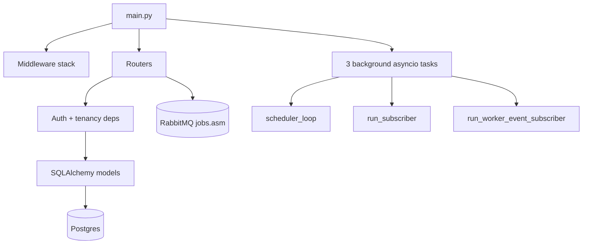

# API Service (FastAPI) `[Module: Core-Platform + ASM]`

> The control plane. Auth, tenancy, RBAC, CRUD, scheduling, job dispatch, and result exposure. Path: `backend/api_service/`.

**Related:** [Overview](overview.md) · [Workers](workers.md) · [API Guide](../04_infra_and_api_guide/api_guide.md) · [Database](../05_database_guide.md) · [Glossary](../02_glossary_and_panel_guide/domain_glossary.md)

---

## Table of Contents
1. [Purpose](#1-purpose)
2. [Architecture](#2-architecture)
3. [Startup / bootstrap lifecycle](#3-startup--bootstrap-lifecycle)
4. [Routes](#4-routes)
5. [Auth & authorization](#5-auth--authorization)
6. [Tenancy](#6-tenancy)
7. [Scheduling](#7-scheduling)
8. [Scoring — the exposure model](#8-scoring--the-exposure-model)
9. [Cross-cutting utilities](#9-cross-cutting-utilities)
10. [Why built this way / trade-offs](#10-why-built-this-way--trade-offs)
11. [Key files & entrypoints](#11-key-files--entrypoints)
12. [Dependencies](#12-dependencies)
13. [Known limitations / tech debt](#13-known-limitations--tech-debt)
14. [Future improvements](#14-future-improvements)
15. [How this connects to other modules](#15-how-this-connects-to-other-modules)

---

## 1. Purpose
`api_service` is the only service the frontend talks to. It authenticates users (via Supabase), enforces multi-tenant isolation and RBAC, performs all CRUD against PostgreSQL, dispatches scan jobs to the Go workers over RabbitMQ, runs the recurring scheduler, and serves scan results and dashboards back to the UI. It also hosts the notification bus in-process.

## 2. Architecture
Layered FastAPI app:

```
main.py            → app assembly, middleware, routers, startup/shutdown tasks
config/settings.py → env-driven config with fail-fast guards
routes/*.py        → one router per resource; thin, call into utils/models
models/*.py        → SQLAlchemy 2.0 async models (declarative Base)
utils/*.py         → auth, tenancy, rate-limit, scheduler, observability, SSRF guard, DB
scoring/exposure.py→ the explainable exposure model
migrations/        → Alembic (owns production DDL)
tests/             → pure-logic unit tests (no DB)
```



## 3. Startup / bootstrap lifecycle
`main.py` assembles the app in this order:
1. Prepend backend root to `sys.path` so `notificationservice` (sibling package) imports.
2. **CORS** — explicit allow-list from `CORS_ORIGINS_URL` (never `*`), `allow_credentials=True`.
3. **`install_hardening`** — `SecurityHeadersMiddleware` (HSTS, CSP `default-src 'self'`, X-Frame-Options DENY, nosniff, Referrer-Policy, Permissions-Policy) + a catch-all exception handler that logs with a `correlation_id` and returns a generic 500.
4. **`install_rate_limit`** — Redis fixed-window limiter.
5. **`install_observability`** — logging, optional Sentry/OTel, `/metrics`.
6. **`@app.on_event("startup")`** — `init_db()`, then three background asyncio tasks: `scheduler_loop`, `run_subscriber` (realtime bus), `run_worker_event_subscriber` (worker→notification bridge). Each wrapped in try/except so a failure only warns.
7. **`@app.on_event("shutdown")`** — cancel tasks; close DB, Redis, queue, ClickHouse.

Health probes: `GET /` (root), `GET /health` (liveness), `GET /readyz` (readiness — hard-checks DB, best-effort Redis/RabbitMQ, 503 if DB down), `GET /metrics` (Prometheus text).

> ⚠️ Uses deprecated `@app.on_event` hooks rather than a lifespan context manager — tech debt, works on FastAPI 0.104.1.

**Config fail-fast** (`config/settings.py`): raises `RuntimeError` if `DATABASE_URL` or `SUPABASE_URL` is unset, or (in non-DEBUG) if `CORS_ORIGINS` is empty. Legacy `SECRET_KEY`/`JWT_SECRET` default to empty (no guessable fallback — audit C-1). `REQUIRE_SCAN_VERIFICATION` defaults true.

## 4. Routes
See the [API Guide](../04_infra_and_api_guide/api_guide.md) for full endpoint detail. Routers registered in `main.py`: `auth_supabase`, `auth_webhook`, `orgs`, `billing`, `services`, `asm`, `vs` (two routers), `activity`, `assets`, `reports`, `notifications`, `ws`, `tasks`, `marketing`. Router index and prefixes: [inventory §4](../00_inventory.md#4-api-surface-by-service).

`asm.py` (2201 lines) is the core module router — discoveries lifecycle, the flat findings tables (subdomains/ips/ports/services/ssl/api-endpoints/cloud/admin/backup/changes/repo-findings/saas-apps/user-accounts), dashboards, exposure, and runs.

## 5. Auth & authorization
See [§ Authentication in the API Guide](../04_infra_and_api_guide/api_guide.md#authentication) for the full contract. Summary:
- **Supabase JWT verification** (`utils/supabase_auth.py`): branches on token `alg` — HS256 (shared `SUPABASE_JWT_SECRET`) or ES256/RS256 (cached JWKS). Algorithms are **pinned server-side** (never derived from the token header → defeats alg-confusion). Audience pinned to `"authenticated"`.
- `get_current_user` → `CurrentUser(user_id, email, role, org_id)`. Role and org come from `member_profiles`, never the client.
- `require_role(*allowed)` — RBAC dependency factory (403 on mismatch).
- **JIT provisioning** (`utils/identity_sync.sync_profile_and_org`): first sight of a user creates an `Organization` (caller = owner) + `MemberProfile`; idempotent.
- **Legacy dict auth** (`utils/auth_utils.get_current_user`) still used by `asm`, `vs`, `billing`, `services` — see [migration note](overview.md#5-the-active-migration-you-must-know-about).

## 6. Tenancy
`utils/tenancy.py`: `scope_to_org(stmt, model, org_id)` and `require_org(org_id)` (403 "No organization context"). Every application table has `org_id` FK → `organizations` `ON DELETE CASCADE`. `user_id` is the Supabase subject string, **never a FK** — so removing a user cannot cascade-delete org data (guaranteed by `tests/test_tenancy.py`). `assets.py` is the reference implementation.

## 7. Scheduling
`utils/scheduler.py` — one async loop, polls every 60s. Each tick:
1. **Reap** stale `RUNNING` discoveries (>30m no update → `FAILED`, re-eligible).
2. **Re-enqueue** due `INTERVAL`/`CRON` discoveries via `SELECT ... FOR UPDATE SKIP LOCKED` (multi-replica safe) → publish `jobs.asm`, recompute `next_run_at`.
3. **Auto-score** assets from real scan data (bounded per tick, memoized per-org to kill N+1).
4. **Fire** due scheduled reports.

`QUICK` schedules never recur. Math in `utils/schedule_math.py` (`parse_interval`, `next_cron` via croniter, `compute_next_run`).

## 8. Scoring — the exposure model
`scoring/exposure.py` — the **defensible, explainable** model (replaces the legacy Go magic-number heuristic). Input `AssetSignals` → output `ExposureScore` (0–100 int, severity band, per-factor `ScoreFactor` breakdown):
- Sensitive ports (`SENSITIVE_PORTS`: FTP, Telnet, SMB, MSSQL/MySQL/Oracle, Docker API, …) add base points; other open ports add a smaller base each.
- **CVE branch** (worst CVSS/10×30, EPSS boost ×20, KEV flat +25, volume bonus) — present but **dead in production** (no CVE persistence feeds `AssetSignals.cves`; see [SCORING doc note](#13-known-limitations--tech-debt)).
- TLS issues, admin endpoints (6 each), backup files (8 each), exposed APIs (1 each, capped 10).
- Context multipliers: `internal_dampen` 0.45× if not public; asset-criticality multiplier. Clamped 0–100.
- `SEVERITY_BANDS`: ≥80 critical, ≥60 high, ≥40 medium, ≥20 low, else info. Weights in `DEFAULT_WEIGHTS`, **per-tenant tunable** via ASM settings.

The Go worker computes per-IP exposure *during* scans (its `exposure_scoring` step); the reporting layer only persists it. This Python model is what `assets.py`'s rescore and the `/asm/exposure` endpoint use. Covered by `tests/test_exposure_scoring.py`.

## 9. Cross-cutting utilities
- `utils/database.py` — async engine (`pool_pre_ping`, env-tuned pool), `async_sessionmaker` (`expire_on_commit=False`), `get_db()` dependency, `init_db()` (only `create_all` if `DB_AUTO_CREATE=true`; Alembic owns prod DDL).
- `utils/rate_limit.py` — Redis fixed-window; auth POST 10/min, other writes 120/min per IP; **fail-open** if Redis down; `X-Forwarded-For` trusted only when `TRUSTED_PROXY_HOPS>0`.
- `utils/target_guard.py` — **SSRF intake guard**: rejects loopback/private/link-local (169.254/16 metadata)/reserved/multicast literals + hostname denylist. Deliberately does *not* resolve hostnames (anti-rebinding — worker does the authoritative post-resolution filter).
- `utils/observability.py` — structured logging, optional Sentry (`SENTRY_DSN`), optional OTel (`OTEL_EXPORTER_OTLP_ENDPOINT`), dependency-liveness `/metrics`.
- `utils/http_hardening.py` — security headers + generic-500 handler.

## 10. Why built this way / trade-offs
- **FastAPI + async SQLAlchemy** — [INFERRED] chosen for a CRUD/policy/integration-heavy control plane where Pydantic validation and async I/O to Postgres/Redis/RabbitMQ dominate. **Pro:** ergonomic, fast to build, strong typing. **Con:** the async ORM has sharper edges than sync; two auth systems accreted during migration.
- **API never scans** — it only enqueues. **Pro:** API stays responsive, scans survive API restarts. **Con:** more moving parts (queue, workers, reporting) and eventual-consistency in the UI.
- **Identity delegated to Supabase** — **Pro:** no password storage, OAuth for free, JWT standard. **Con:** hard dependency on an external SaaS for login; JWKS caching complexity.

## 11. Key files & entrypoints
`main.py` · `config/settings.py` · `routes/asm.py` (core) · `routes/assets.py` (reference secure pattern) · `utils/supabase_auth.py` · `utils/scheduler.py` · `scoring/exposure.py` · `migrations/env.py`.

## 12. Dependencies
Talks to: **PostgreSQL** (asyncpg), **Redis** (rate-limit/pub-sub/dedup), **RabbitMQ** (publish `jobs.asm`), **Supabase** (JWT/JWKS). Hosts **notificationservice** in-process. Python deps: see [inventory §3](../00_inventory.md#3-external-dependencies--tooling).

## 13. Known limitations / tech debt
- Two coexisting auth systems; `asm.py` still on legacy dict auth + in-body write gating.
- `billing.py` / `services.py` still use legacy `Company`/`User` tenancy.
- `_company_user_ids` queried but unused in ~20 `asm.py` endpoints (extra query/request).
- `/asm/exposure` scores per-IP in Python capped at `ASM_MAX_EXPOSURE_IPS` (10000) with a `truncated` flag — real fix is SQL `GROUP BY` on persisted scores.
- CVE/EPSS/KEV scoring branch is dead (no CVE persistence). Documented in `docs/SCORING.md` history.
- `asm.py` inconsistencies: `/runs/{id}` returns 403 vs 404 elsewhere (existence oracle); `/stop` overloads `status=FAILED`; some dashboard fields hardcoded 0; page/page_size not lower-bounded; discoveries list has no page_size cap. `/asm/settings` is per-user (not org-scoped) and accepts an unvalidated dict.
- `settings.py` route is dead (unregistered). Deprecated `@app.on_event` hooks. `observability.py` is a skeleton. Rate limiter fails open.
- `requirements.txt`: wrong `dotenv` entry; unpinned packages.

## 14. Future improvements
- Finish migrating `asm`/`vs`/`billing`/`services` to `CurrentUser` + `require_role`; retire `auth_models.py`.
- Move exposure aggregation into SQL. Persist point-in-time attack-surface snapshots to power the exposure-trend chart.
- Persist CVE findings (from nuclei) so the CVE scoring branch activates.
- Migrate to a lifespan context manager; flesh out observability; consider a durable VS store.

## 15. How this connects to other modules
- **→ Workers:** publishes `jobs.asm`; the Go control-plane also authenticates internal calls with `X-Internal-Token`. See [Workers](workers.md).
- **→ Reporting:** shares the `asm_*` tables the reporting consumer writes and this service reads. See [Reporting](reporting.md).
- **→ Notification service:** hosts it in-process; publishes realtime scan events. See [Notification Service](notificationservice.md).
- **→ Frontend:** the entire `/api/v1` + `/ws/realtime` surface. See [Frontend](frontend.md).
- **New modules** inherit this service's auth/tenancy/scheduler/queue plumbing — add a router following `assets.py`.
