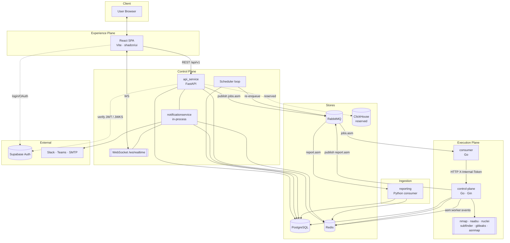
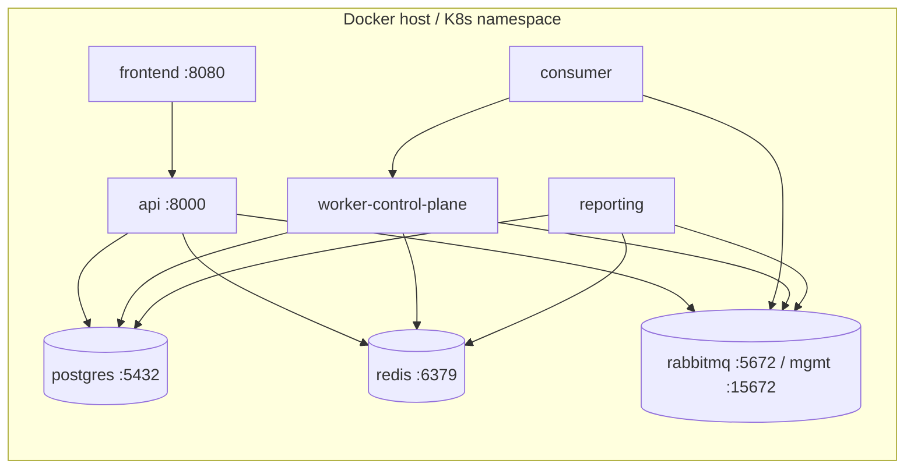
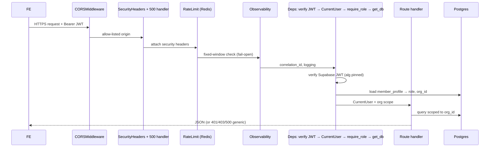
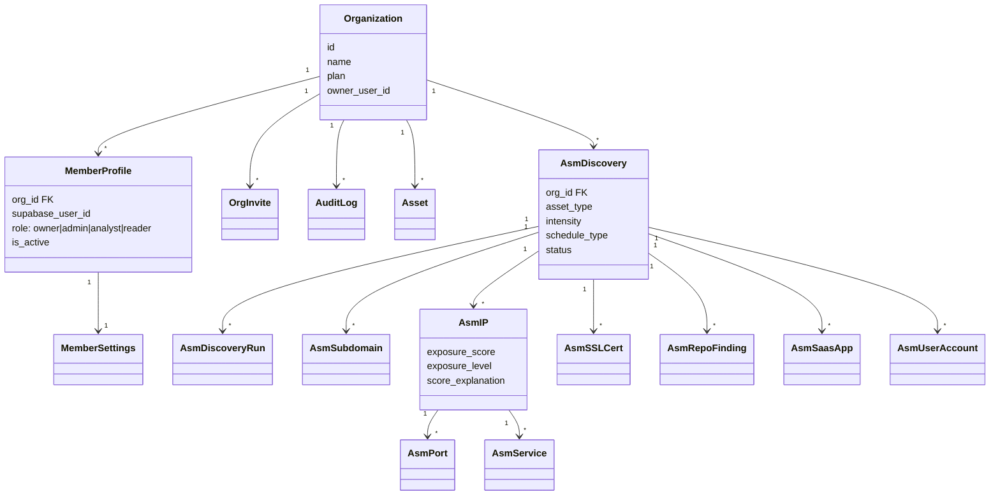
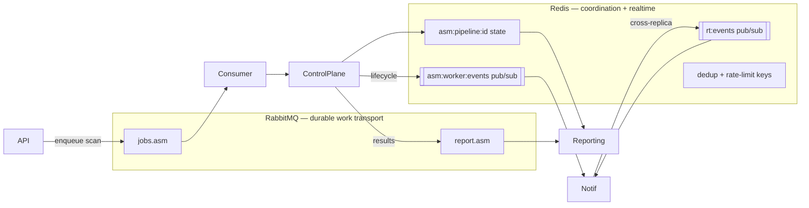

# Architecture Diagrams

> Full-system diagrams for CyberSentinel. Every service, store, queue, and connection. Mermaid renders in GitHub and most Markdown viewers.

**Related:** [Overview](overview.md) · [Inventory](../00_inventory.md) · [Infra](../04_infra_and_api_guide/infra.md)

---

## 1. System component diagram

---

## 2. Deployment diagram (docker-compose today)

Containers and their `depends_on` health-gates are detailed in the [Infra Guide](../04_infra_and_api_guide/infra.md). Note `reporting` and `worker-control-plane` publish no ports; only `frontend`, `api`, and the store management UIs are reachable.

---

## 3. Request lifecycle (authenticated REST call)

---

## 4. Class/model relationships (tenancy + ASM core)

Full ER diagram with every column is in the [Database Guide](../05_database_guide.md).

---

## 5. Two message systems (do not confuse them)

**Rule of thumb:** RabbitMQ carries *work that must not be lost* (jobs, results). Redis carries *coordination and ephemeral realtime* (pipeline scratch state, pub/sub events, dedup, rate limits).
