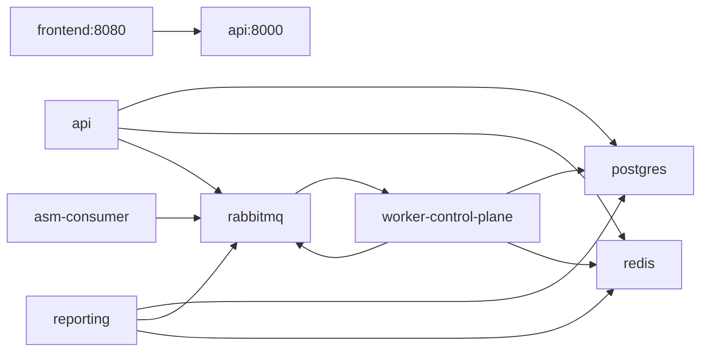

# Infrastructure (Developer View) `[Module: Core-Platform]`

> How the pieces are wired for running the system — local compose, containers, CI. The full ops-oriented guide (staging/prod, scaling, secrets, DR) is [04_infra_and_api_guide/infra.md](../04_infra_and_api_guide/infra.md); this file is the developer's orientation.

**Related:** [Overview](overview.md) · [Local Setup](../03_local_setup_guide.md) · [Ops Infra Guide](../04_infra_and_api_guide/infra.md)

---

## 1. Compose topology
`docker-compose.yml` defines the full local stack:

| Service | Image / build | Port | Depends on (healthy) |
|---|---|---|---|
| postgres | `postgres:16-alpine` | 5432 | — |
| redis | `redis:7-alpine` | 6379 | — |
| rabbitmq | `rabbitmq:3.13-management-alpine` | 5672, 15672 (mgmt) | — |
| api | build `backend/api_service/Dockerfile` | 8000 | postgres, redis, rabbitmq |
| worker-control-plane | build `backend/workers/Dockerfile`, cmd `control-plane` | — | rabbitmq, postgres |
| asm-consumer | build `backend/workers/Dockerfile`, cmd `asm-consumer` | — | rabbitmq |
| reporting | build `backend/reporting/Dockerfile` | — | postgres, rabbitmq |
| frontend | build `frontend/Dockerfile` | 8080 | api |

Env is supplied via `env_file` per service (`.env` files — names only, never commit values). `worker-control-plane` and `reporting` publish no ports (internal only). Postgres data persists in the `pgdata` named volume.

## 2. Local dev entrypoints
- `scripts/dev.sh` and the `Makefile` orchestrate bringing the stack up; `startup/` holds boot helpers; `scripts/test-api.sh` exercises the API. Exact commands: [Local Setup Guide](../03_local_setup_guide.md).

## 3. CI
`.github/workflows/ci.yml` runs per-service jobs:
- **backend (api):** Python 3.11, install requirements + pytest/ruff; `ruff check .` (non-blocking) then `pytest` with test env values.
- **workers:** Go 1.24; `go build ./...`, `go vet ./...`, `go test ./...` (non-blocking vet).
- **frontend:** Node 20; `npm ci`; `npm run lint` (soft); **`npx tsc --noEmit` (blocking)**; `npm run build`.

## 4. Kubernetes & Terraform
`infrastructure/kubernetes/` and `infrastructure/terraform/` hold the cluster deploy and cloud provisioning. Detailed in the [Ops Infra Guide](../04_infra_and_api_guide/infra.md).

## 5. Two data planes recap
- **RabbitMQ:** durable job/result transport (`jobs.asm`, `report.asm`).
- **Redis:** coordination + realtime (pipeline state, pub/sub, dedup, rate limits).
See [architecture_diagram.md §5](architecture_diagram.md#5-two-message-systems-do-not-confuse-them).

## 6. Environment variables (names only)
Collected across compose/code. **Never output values.**
- **Postgres:** `POSTGRES_DB`, `POSTGRES_USER`, `POSTGRES_PASSWORD`, `DATABASE_URL`
- **RabbitMQ:** `RABBITMQ_USER`, `RABBITMQ_PASSWORD`, `RABBITMQ_DEFAULT_USER`, `RABBITMQ_DEFAULT_PASS`, `RABBIT_URL`, `ASM_RABBIT_JOB_QUEUE`
- **Redis:** `REDIS_URL`
- **Supabase / auth:** `SUPABASE_URL`, `SUPABASE_JWT_SECRET`, `SUPABASE_WEBHOOK_SECRET`, `SUPABASE_ANON_KEY`
- **API:** `CORS_ORIGINS_URL`, `DEBUG`, `DB_AUTO_CREATE`, `TRUSTED_PROXY_HOPS`, `REQUIRE_SCAN_VERIFICATION`, `ASM_MAX_EXPOSURE_IPS`
- **Workers:** `GIN_HOST`, `GIN_PORT`, `X_INTERNAL_TOKEN`, `JOB_MAX_CONCURRENCY`, `TASK_TIMEOUT_SECONDS`, `ASM_ENDPOINT`
- **Observability:** `SENTRY_DSN`, `OTEL_EXPORTER_OTLP_ENDPOINT`
- **Frontend (build):** `VITE_API_URL`, `VITE_SUPABASE_URL`, `VITE_SUPABASE_ANON_KEY`
- **SMTP (notifications):** SMTP host/port/user/pass/from (via python-decouple)

> The above is a best-effort union of referenced names; confirm the authoritative set against each service's `.env.example`. `[NEEDS CONFIRMATION FROM DEV]`
