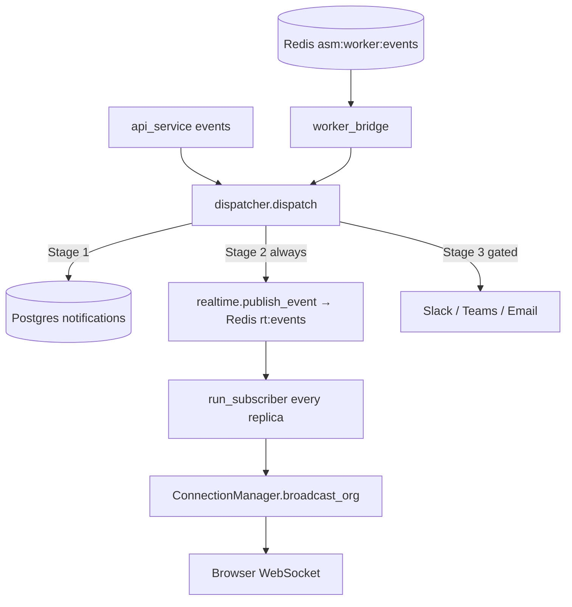

# Notification Service `[Module: Core-Platform]`

> Realtime (WebSocket) + multi-channel (Slack/Teams/Email) notification fan-out. Path: `backend/notificationservice/`. Runs **in-process inside `api_service`** (imported via `sys.path`), not as a separate container.

**Related:** [Overview](overview.md) · [API Service](api_service.md) · [Frontend](frontend.md)

---

## 1. Purpose
Deliver events to users three ways: persist in-app `Notification` rows, push realtime over WebSocket, and fan out to external channels (Slack/Teams/Email) — each gated by the org's settings and each member's preferences. It bridges Go-worker scan events into user-facing notifications.

## 2. Architecture
```
events.py        → event taxonomy (scan.*, findings.new, finding.critical/high, team.message);
                   RULE_FOR_EVENT (event → ASM-settings toggle); SEVERITY_RANK
realtime.py      → ConnectionManager singleton (_by_org), broadcast_org (concurrent, 5s timeout,
                   to_user targeting, dead-socket pruning), publish_event → Redis rt:events,
                   run_subscriber (per-process background task)
worker_bridge.py → subscribes Redis asm:worker:events; on completed counts subdomains/IPs/
                   high-exposure IPs → dispatches SCAN_COMPLETED (+ FINDING_HIGH if high_count>0)
dispatcher.py    → central dispatch(): (1) persist per-member in-app rows honoring NotificationPreference.in_app;
                   (2) realtime publish_event (always); (3) outbound channels gated by owner AsmSettings toggle
channels.py      → post_slack / post_teams (httpx 8s), send_email_async (threaded blocking send)
email.py         → standalone SMTP emailer with branded HTML templates (separate from utils/emailer.py)
```



## 3. Delivery guarantees & dedup
- **Cross-replica realtime:** `publish_event` writes to Redis channel `rt:events`; every replica's `run_subscriber` re-broadcasts to its own connected sockets → a user connected to any replica gets the event.
- **Dedup:** `dispatcher.acquire_once(key, ttl)` (Redis lock) ensures once-only dispatch across replicas — worker events keyed `worker:{event_id}` (ttl 1800s).
- **Best-effort:** every stage is wrapped so it never raises into the caller/request path. Slack/Teams/email failures are swallowed and logged.
- **Preference/rule gating:** in-app rows respect each member's `NotificationPreference.in_app`; outbound channels respect the owner's `AsmSettings` rule toggles via `RULE_FOR_EVENT`/`_rule_enabled`. Unmapped events never push to channels. Covered by `tests/test_notifications_dispatch.py`.

## 4. Realtime transport (frontend contract)
The browser connects to `${API}/ws/realtime` passing the Supabase JWT as a **WebSocket subprotocol** `["cybersentinel-auth", token]` (kept out of the URL/logs), with a 25s heartbeat ping and capped-backoff reconnect. Events drive the [LiveScanPopup and live indicators](panel_guide.md). See [Frontend §Auth/Realtime](frontend.md).

## 5. Why built this way / trade-offs
[INFERRED] In-process + Redis pub/sub avoids standing up a separate notification microservice while still supporting horizontal scaling — Redis is the cross-replica bus, and each API replica owns its own WebSocket connections.
- **Pro:** simple deploy (no extra service), scales with the API, resilient (best-effort).
- **Con:** notification load shares the API process's resources; a separate service would isolate blast radius. `[NEEDS CONFIRMATION FROM DEV]` whether extraction is planned.

## 6. Key files
`dispatcher.py` · `realtime.py` · `worker_bridge.py` · `events.py` · `channels.py` · `email.py`.

## 7. Known limitations / tech debt
- Two emailers exist: `notificationservice/email.py` (branded templates) and `utils/emailer.py` (imported by `channels.py`) — consolidate.
- Only `completed`/`failed` worker events are bridged; `started` comes from the API side — a split source of truth for scan lifecycle.
- Runs in-process — no isolation from API load spikes.

## 8. Future improvements
Consolidate emailers; consider extracting to a standalone service if notification volume grows; add delivery receipts/retries for outbound channels.

## 9. How this connects to other modules
- **← Workers:** consumes `asm:worker:events`.
- **← API service:** dispatched directly for API-originated events (scan.started, team.message); hosts the subscribers.
- **→ Frontend:** the `/ws/realtime` event stream.
- **New modules** emit events by calling `dispatch(...)` with an event type; add the type to `events.py` and map it in `RULE_FOR_EVENT` to make it channel-eligible.
