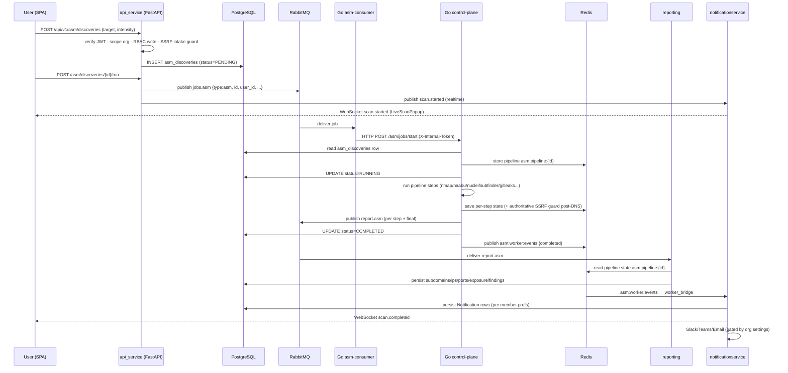

# Developer Guide — System Overview

> **Goal.** A senior engineer joining the team reads this and the per-service files and understands the *entire system deeply* — not just what exists, but *why* it exists that way.

**In this guide:** [Overview](overview.md) · [Architecture Diagram](architecture_diagram.md) · [API Service](api_service.md) · [Workers](workers.md) · [Reporting](reporting.md) · [Notification Service](notificationservice.md) · [Frontend](frontend.md) · [Infra](infra.md)

---

## Table of Contents
1. [Mental model](#1-mental-model)
2. [The end-to-end scan lifecycle](#2-the-end-to-end-scan-lifecycle)
3. [Services at a glance](#3-services-at-a-glance)
4. [Design principles that recur everywhere](#4-design-principles-that-recur-everywhere)
5. [The active migration you must know about](#5-the-active-migration-you-must-know-about)
6. [Where to start reading code](#6-where-to-start-reading-code)

---

## 1. Mental model

CyberSentinel is best understood as **four planes**:

| Plane | Services | Responsibility |
|---|---|---|
| **Experience** | `frontend` | Render the product; hold no security logic |
| **Control** | `api_service` | Auth, tenancy, RBAC, CRUD, scheduling, dispatch jobs, expose results |
| **Execution** | `workers` (Go) | Do the actual scanning against the internet, fast and concurrently |
| **Ingestion/Notify** | `reporting`, `notificationservice` | Persist scan output; alert users in realtime and over channels |

The planes are decoupled by **queues and shared state** (RabbitMQ, Redis, Postgres), never by direct synchronous coupling between the control plane and the execution plane at scale. This is the single most important structural decision: **the API never runs a scan itself.** It writes a row and drops a message. Everything else is asynchronous.

**Why this split?** ([INFERRED] from language choices and code patterns)
- Scanning is **I/O-bound and massively concurrent** (thousands of ports/hosts). Go's goroutines + channels make this cheap and safe — hence the execution plane is Go.
- The control plane is **CRUD + policy + integration heavy**. FastAPI's async ecosystem, Pydantic validation, and SQLAlchemy make that ergonomic — hence Python.
- The two never block each other: a slow scan can't stall an API request, and API downtime can't lose a scan (it's already queued).

---

## 2. The end-to-end scan lifecycle

This one flow touches every service. Learn it and the system makes sense.

**Key correctness properties baked into this flow:**
- **ACK-after-success.** The Go control-plane runs the scan *synchronously* inside the HTTP request from the consumer; the RabbitMQ message is only ACKed when the scan reaches a terminal state. A worker crash mid-scan leaves the message un-ACKed → dead-lettered, never silently lost.
- **Idempotency.** Re-delivered jobs are skipped if the discovery is already `COMPLETED`, or `RUNNING` within the reaper heartbeat window. Safe across replicas.
- **Two-layer SSRF defense.** The API rejects private/reserved literals at intake but deliberately does *not* resolve hostnames (anti-DNS-rebinding); the worker applies the authoritative filter *after* DNS resolution / CIDR expansion.
- **Terminal-state writes use a fresh short context** so a scan that exhausts its whole timeout budget still records `FAILED`/`COMPLETED` rather than getting stuck in `RUNNING`.

---

## 3. Services at a glance

| Service | Entrypoint | Talks to | Via |
|---|---|---|---|
| `frontend` | `src/App.tsx` | api_service | REST `/api/v1`, WebSocket `/ws/realtime`, Supabase directly for auth |
| `api_service` | `main.py` | Postgres, Redis, RabbitMQ, Supabase | asyncpg, redis, pika/aio_pika, JWT/JWKS |
| `workers` (consumer) | `consumer/cmd/asm/main.go` | RabbitMQ, control-plane | amqp consume, HTTP forward |
| `workers` (control-plane) | `control-plane/cmd/main.go` | Postgres, Redis, RabbitMQ, scan CLIs | pgx, redis, amqp publish, `os/exec` |
| `reporting` | `asm/main.py` | RabbitMQ, Redis, Postgres | pika consume, redis read, SQLAlchemy write |
| `notificationservice` | imported by `api_service` | Redis, Postgres, Slack/Teams/SMTP | redis pub/sub, SQLAlchemy, httpx |

Full detail per service in the linked files. Integration points between them are listed in each file's *"How this connects to other modules"* section.

---

## 4. Design principles that recur everywhere

1. **Tenant isolation is non-negotiable.** Every application table has `org_id` (FK → `organizations`, `ON DELETE CASCADE`). Every query is scoped by org. `require_org` raises 403 without org context. `user_id` is the Supabase subject *string*, never a FK — so deleting a user can never cascade-delete org data.
2. **Identity is delegated, roles are ours.** Supabase issues and signs JWTs; the backend only *verifies* them (algorithms pinned server-side to defeat alg-confusion). Role and org are read from our DB, never trusted from the token.
3. **RBAC ladder:** `owner > admin > analyst > reader`. Writers are owner/admin/analyst; readers are read-only. `owner` is never assignable via invite or role change.
4. **Honesty over fabrication.** The codebase repeatedly refuses to fake data: empty exposure-trend charts show an honest empty state, VS MTTR/coverage report `0`, reports say "0 vulnerabilities" rather than inventing findings, the Marketplace "Install" is explicitly a "coming soon" toast. Preserve this — it's a deliberate product value.
5. **Explainable scoring.** Every exposure point is attributable to a factor (`+N because open sensitive port 3389`). The scoring model is centralized and tenant-tunable. See [scoring in api_service.md](api_service.md#scoring--the-exposure-model).
6. **Fail-safe defaults.** Rate limiter fails *open* (availability over strictness). Notification dispatch is always best-effort and never raises into the request path. Startup background tasks are wrapped so a failing subscriber only warns.
7. **Multi-replica safety.** The scheduler uses `SELECT ... FOR UPDATE SKIP LOCKED`; the notification bus uses Redis dedup locks; RabbitMQ competing-consumers distribute work. Any service can run N replicas.

---

## 5. The active migration you must know about

The code is mid-way through a **security-remediation + tenancy migration** (inline comments cite audit IDs C-1, C-2, H-6, and "Phase 0/1/2/3"). Two models coexist:

| | Legacy (being retired) | Current (target) |
|---|---|---|
| Tenancy root | `companies` + `users` tables | `organizations` + `member_profiles` |
| Auth dependency | `auth_utils.get_current_user` → `dict` | `supabase_auth.get_current_user` → `CurrentUser` |
| Write gating | in-body `_require_write_access(...)` | `require_role(...)` FastAPI dependency |
| Routers still on legacy | `asm.py`, `vs.py`, `billing.py`, `services.py` | `assets.py`, `reports.py`, `orgs.py`, `tasks.py`, `notifications.py`, `activity.py`, `auth_supabase.py`, `ws.py` |

**`assets.py` is the reference implementation of the target pattern** — read it first when writing new endpoints. Do not add new code on the legacy path. See open questions [#2 and #3](../00_inventory.md#7-open-questions--confirmation-needed).

---

## 6. Where to start reading code

| To understand… | Start at |
|---|---|
| How the API boots | `backend/api_service/main.py` |
| The canonical secure endpoint pattern | `backend/api_service/routes/assets.py` |
| The core module | `backend/api_service/routes/asm.py` |
| How a scan actually runs | `backend/workers/executor/runner/task.go` |
| How results get persisted | `backend/reporting/asm/main.py` + `asm/assets/domain.py` |
| Exposure scoring | `backend/api_service/scoring/exposure.py` |
| The UI shell & routing | `frontend/src/App.tsx` + `frontend/src/layouts/AppLayout.tsx` |
| The ASM UI | `frontend/src/pages/app/ASM.tsx` |

Continue to the [full architecture diagrams](architecture_diagram.md) or jump into a service file.
