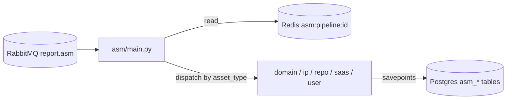

# Reporting Consumer `[Module: ASM]`

> Persists worker scan results into PostgreSQL. Path: `backend/reporting/`. A RabbitMQ consumer on queue `report.asm`.

**Related:** [Overview](overview.md) · [Workers](workers.md) · [API Service](api_service.md) · [Database](../05_database_guide.md)

---

## 1. Purpose
The Go workers *compute* scan results; the reporting service *persists* them. It consumes the `report.asm` queue, reads the full pipeline state from Redis (`asm:pipeline:{job_id}`), and writes the discovered assets and findings into the `asm_*` tables that `api_service` then serves to the UI. **It does not score anything** — scoring happens upstream in the worker's `exposure_scoring` step; reporting only stores the results verbatim.

## 2. Architecture
```
asm/main.py         → RabbitMQ consumer; reads Redis pipeline; dispatches by asset_type
asm/assets/
  domain.py (67K)   → the de-facto shared library (no base class):
                      store_step_data, store_ports, geo lookups, snapshot/change diffing
  ip.py             → exposure_scoring → AsmIP; whois_rdap → owner/country
  repo.py           → repo_secret_scan → AsmRepoFinding
  saas.py           → saas_detect → AsmSaasApp
  user.py           → email_leak_check → AsmUserAccount
  (cloud stages handled in domain/related)
```

Each `process_*_asm` follows an identical skeleton: resolve org → find/create `AsmDiscoveryRun` → iterate `COMPLETED` steps inside `db.begin_nested()` savepoints → commit a summary.



## 3. Per-asset-type persistence
| asset_type | Reads step | Writes | Severity source |
|---|---|---|---|
| domain | subdomains/ips/ports/services/cloud + change tracking | `asm_subdomains`, `asm_ips`, `asm_ports`, `asm_services`, `asm_cloud_resources`, `asm_changes` | none (core) |
| ip | `exposure_scoring`, `whois_rdap` | `asm_ips` (`exposure_score`/`exposure_level`/`score_explanation`, owner/country) | numeric score + level |
| repo | `repo_secret_scan` | `asm_repo_findings` | severity string verbatim from worker |
| saas | `saas_detect` | `asm_saas_apps` | none |
| user | `email_leak_check` | `asm_user_accounts` (breached, breach_count, exposed_data, severity) | severity string verbatim |

**No weights or formulas live in the reporting layer.** `domain.py` also implements snapshot/change diffing with content-hash dedup so `asm_changes` records only real deltas between scans.

## 4. Why built this way / trade-offs
[INFERRED] Persistence is separated from execution so the (Go) scanner can stay a stateless, fast, disposable process while a Python consumer owns the SQLAlchemy schema shared with the API — keeping ORM models in one language and letting reporting scale independently of scanning.
- **Pro:** shared SQLAlchemy models with `api_service`; savepoints isolate per-step failures; reporting can be scaled separately.
- **Con:** `domain.py` at 67K with no base class is a large shared-library file (refactor candidate); results are eventually-consistent (UI lags the scan by the persist step).

## 5. Key files
`asm/main.py` · `asm/assets/domain.py` (shared library) · `asm/assets/ip.py` · `repo.py` · `saas.py` · `user.py`.

## 6. Dependencies
Consumes **RabbitMQ** `report.asm`; reads **Redis** `asm:pipeline:{id}`; writes **PostgreSQL** `asm_*` tables (shares models with `api_service`). Deployed as its own container (`backend/reporting/Dockerfile`), env from `backend/api_service/.env`.

## 7. Known limitations / tech debt
- `domain.py` is a 67K catch-all shared module with no base class — extract a common `AssetProcessor` base.
- No reporting-layer tests.
- Tightly coupled to the exact Redis pipeline shape the worker writes — a schema drift between worker and reporting would silently drop data. `[NEEDS CONFIRMATION FROM DEV]` on versioning strategy.

## 8. Future improvements
Introduce a base processor class; add contract tests against the worker's pipeline JSON; persist point-in-time exposure snapshots here to power the [exposure-trend chart](../02_glossary_and_panel_guide/panel_guide.md); persist CVE findings so the [exposure model's](api_service.md#8-scoring--the-exposure-model) CVE branch activates.

## 9. How this connects to other modules
- **← Workers:** consumes `report.asm` and Redis pipeline state.
- **→ API service:** writes the `asm_*` tables the API reads; shares the SQLAlchemy models.
- **New modules** that produce scan output add a `process_<type>_asm` handler and reuse `domain.py`'s storage helpers.
