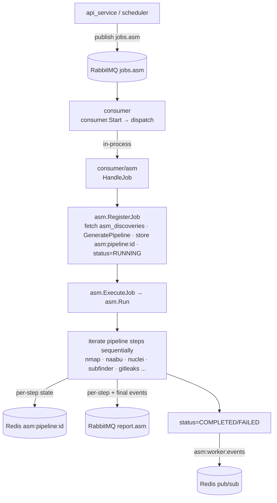

# Go Workers — Scan Pipeline `[Module: ASM]`

> The execution plane. A distributed active-scanning pipeline that runs real security tooling against discovered assets. Path: `backend/workers/`.

**Related:** [Overview](overview.md) · [API Service](api_service.md) · [Reporting](reporting.md) · [Database](../05_database_guide.md)

---

## Table of Contents
1. [Purpose](#1-purpose)
2. [Architecture — one binary](#2-architecture--one-binary)
3. [End-to-end control/data flow](#3-end-to-end-controldata-flow)
4. [The consumer](#4-the-consumer)
5. [The ASM engine (orchestrator + executor)](#5-the-asm-engine-orchestrator--executor)
6. [What the scans actually do](#6-what-the-scans-actually-do)
7. [Queues & state](#7-queues--state)
8. [Concurrency & scaling](#8-concurrency--scaling)
9. [Why Go / trade-offs](#9-why-go--trade-offs)
10. [Key files](#10-key-files)
11. [Known limitations / tech debt](#11-known-limitations--tech-debt)
12. [Future improvements](#12-future-improvements)
13. [How this connects to other modules](#13-how-this-connects-to-other-modules)

---

## 1. Purpose
Consume scan jobs from RabbitMQ and *execute* them: subdomain/OSINT discovery, DNS resolution, HTTP probing, port scanning, service/version fingerprinting, TLS analysis, vulnerability scanning, repo secret scanning, SaaS detection, breach/email-leak checks, and per-IP exposure scoring. Results are published back to RabbitMQ for the [reporting](reporting.md) service to persist.

## 2. Architecture — one binary
One Go module (`module workers`, **Go 1.24**) compiles into a **single `consumer` binary** plus shared
libraries. Both job types run IN-PROCESS with the identical shape — `consumer/<module>/job.go`
`HandleJob` → `executor/<module>`:

| Module | Handler | Engine |
|---|---|---|
| **ASM** | `consumer/asm/job.go` | `executor/asm` engine (registers the job, builds a pipeline, runs all scanning tools). |
| **VS** | `consumer/vs/job.go` | `executor/vs` Scanner adapters (each target scanned by every enabled engine). |

Subdirectories:
- `config/` — env-based config loader.
- `consumer/` — RabbitMQ consumer (`start.go`, bounded pool), `dispatcher.go` (routes on `msg.type`), and one `<module>/job.go` per module running its scan in-process.
- `executor/asm/` — ASM engine, ONE flat `package asm`: job registry & lifecycle (`job_manager.go` `RegisterJob`/`ExecuteJob`), pipeline (`job_pipeline.go` `GeneratePipeline`, `job_types.go`, `job_state.go`), the tool-running pipeline driver (`task.go` ~1520 lines, `ip.go`, `domain.go`, `context.go`, `service.go`), and Redis pipeline persistence (`jobstore.go`, `types.go`).
- `executor/vs/` — VS engine, ONE flat `package vs`: `scanner.go` + per-tool adapters. Same flat shape as `executor/asm/`.
- `executor/tools/` — one wrapper package per external CLI (nmap, nuclei, sslscan, …), **shared** by the ASM runner and the VS adapters.
- `database/` — Postgres (`postgresql.go`, pgxpool) + Redis (`redis.go`) clients.
- `utils/` — RabbitMQ `Queue` wrapper (`queue.go`), zap logger.

## 3. End-to-end control/data flow

## 4. The consumer
`consumer/start.go` → `Start(cfg)`:
- Connects to RabbitMQ queue `cfg.ASMRabbitJobQueue` (default `jobs.asm`), `Consume()` with **manual ack** (`autoAck=false`).
- **Bounded worker pool:** semaphore channel sized by `JOB_MAX_CONCURRENCY` (default 3), backpressure via `sem <- struct{}{}`, RabbitMQ prefetch 16.
- **Ack semantics:** `dispatch(body)` success → `Ack`; failure → `Nack(requeue=false)` → dead-letters (no hot requeue loop).
- **Graceful shutdown** on SIGINT/SIGTERM.
- `consumer/asm/job.go` `HandleJob` runs the pipeline in-process and returns nil for already-processed jobs so the consumer safely ACKs (idempotency).

## 5. The ASM engine (orchestrator + executor)
`consumer/asm/job.go` — `HandleJob(body)`:
- **Body:** `{type, user_id, id}` from the `jobs.asm` envelope.
- **Flow:** unmarshal → `RegisterJob(job)` → `ExecuteJob(job.ID)` **synchronously** → `RemoveJob`.
- **Idempotency:** `RegisterJob` returns `ErrAlreadyProcessed` if the job is `COMPLETED` (always skip) or `RUNNING` within the reaper heartbeat window → `HandleJob` returns nil (consumer ACKs). Other register errors and execute errors return non-nil → message stays un-ACKed → DLQ.
- **Key property:** execution is synchronous / **ACK-after-success** — the RabbitMQ ACK only completes when the scan reaches a terminal state.

`executor/asm/job_manager.go` — `RegisterJob` fetches the `asm_discoveries` row, builds the pipeline (`GeneratePipeline` from `asset_type × intensity`), stores it in Redis `asm:pipeline:{id}` (24h TTL), sets `status=RUNNING`. `ExecuteJob` builds a job-bounded timeout context (`TASK_TIMEOUT_SECONDS`, default 900s) and calls `Run`. **Terminal status writes use a fresh 10s context** so a scan that exhausts its timeout still records its terminal state rather than sticking in `RUNNING`.

## 6. What the scans actually do
`executor/asm/task.go` — `Run(ctx, task)` loads the pipeline from Redis and **iterates steps strictly sequentially**, `switch`ing on each step's `tool`:
- **SSRF authoritative guard** (`ip.go`): after DNS/CIDR expansion, rejects loopback/private/link-local/multicast/unspecified addresses — the definitive anti-DNS-rebinding filter.
- **Alive check** — nmap host discovery + TCP-dial fallback on 80/443.
- **Port scan** — `nmap -n -Pn --open -oG -` (supports `--top-ports N`, full `-p-`, UDP `-sU`); greppable-output parse → `{ip, port, protocol}`.
- **Service fingerprint** — nmap service/version detection → service/version/product.
- **Enrichment** — `ip-api.com/json` (geo/ASN/ISP), `rdap.org/ip/<ip>` (WHOIS).
- **Exposure scoring** (in-worker heuristic) — open-ports and sensitive-port weighting → `AsmIP.exposure_score`/`exposure_level`/`score_explanation` (the *only* place these originate; the reporting layer just persists them).
- Plus subdomain/OSINT discovery (subfinder), nuclei vuln scan, repo secret scan (gitleaks), SaaS detection, and email-leak/OSINT stages.

## 7. Queues & state
**Two distinct messaging systems — do not confuse:**
- **RabbitMQ** (`utils/queue.go`) — durable job/report transport: `jobs.asm` (in) and `report.asm` (out). `report.asm` is a **fatal** dependency at consumer boot (`InitReportQueue`).
- **Redis** (`database/redis.go`) — `asm:pipeline:{id}` pipeline state (24h TTL) and `asm:worker:events` pub/sub (scan lifecycle → notification bridge; only `completed`/`failed` are published, `started` comes from the API side).

## 8. Concurrency & scaling
- **Consumer:** bounded goroutine pool (`JOB_MAX_CONCURRENCY`, default 3) + prefetch 16 — one pool slot is held for the full duration of each in-process scan (ASM and VS alike). **Within a single ASM scan, pipeline steps run sequentially**, bounded by `TASK_TIMEOUT_SECONDS`.
- **Horizontal scaling:** the binary is stateless (state in Postgres/Redis/RabbitMQ). RabbitMQ competing-consumers + prefetch distribute work; the reaper-window idempotency guard makes redelivery safe across replicas.
- **Crash safety:** ACK-after-success → a mid-scan crash dead-letters the message rather than losing it.

## 9. Why Go / trade-offs
[INFERRED] Go was chosen for the execution plane because scanning is I/O-bound and massively concurrent — goroutines + channels make thousands of concurrent port/host probes cheap and safe, and a single static binary is trivial to deploy in a scanning container with the CLI tools on `PATH`.
- **Pros:** high concurrency, low memory per task, easy tool shell-outs, fast cold start.
- **Cons:** business logic split across two languages (Go execution vs Python control/persist); the `task.go` driver is a large 1520-line switch; per-scan steps are sequential (not yet parallelized within a scan).

## 10. Key files
`consumer/cmd/main.go` · `consumer/start.go` · `consumer/dispatcher.go` · `consumer/asm/job.go` · `consumer/vs/job.go` · `executor/asm/job_manager.go` · `executor/asm/job_pipeline.go` · `executor/asm/task.go` · `executor/asm/ip.go` · `executor/vs/scanner.go` · `utils/queue.go` · `database/redis.go`.

## 11. Known limitations / tech debt
- **Hard-coded dev path** `/home/anonymous/go/bin` baked into `tools/verify.go`/`SetupPath` — remove before prod. `[NEEDS CONFIRMATION FROM DEV]`
- **Several advanced stage labels** (`asnmap`, `admin_finder`, `backup_detector`, `api_detector`, `config_review_readonly`, `full_osint_correlation`, `deep_misconfig_analysis`, `top_ports_services`, `public_endpoint_detect`) exist as `case` labels — real handlers vs placeholders unaudited. `[NEEDS CONFIRMATION FROM DEV]`
- **Reaper referenced but not present** in `workers/` — stale-`RUNNING` recovery is deferred to "the reaper or DLQ replay"; the actual reaper lives in the api_service scheduler. `[NEEDS CONFIRMATION FROM DEV]`
- **`JobTypeVS = "vs"`** defined but no VS path wired — dormant/future job type.
- **DLQ footgun** (`queue.go`): existing queues declared without dead-letter args can't be re-declared with them (RabbitMQ `PRECONDITION_FAILED`); first rollout requires draining/deleting old `jobs.asm`/`report.asm`.
- **`RegisterJob` does synchronous Postgres/Redis calls under the registry lock** — couples registration latency to DB health.
- Commented-out RUNNING push to `report.asm` (`task.go`) is intentional — only terminal states are reported.

## 12. Future improvements
Parallelize independent pipeline steps within a scan; extract handlers out of the `task.go` switch; parameterize tool paths; wire real progress events; build the VS execution path; add a dedicated reaper or confirm the scheduler is authoritative.

## 13. How this connects to other modules
- **← API service:** receives `jobs.asm` and `jobs.vs`. The VS worker calls the API's internal credential endpoint with `X-Internal-Token`.
- **→ Reporting:** publishes `report.asm`/`report.vs` and writes `asm:pipeline:{id}` that reporting reads.
- **→ Notification service:** publishes `asm:worker:events` consumed by the worker bridge.
- **New scanning modules** reuse the `consumer/<module>/job.go` → `executor/<module>` scaffold — add a job type, a handler, and an engine.
