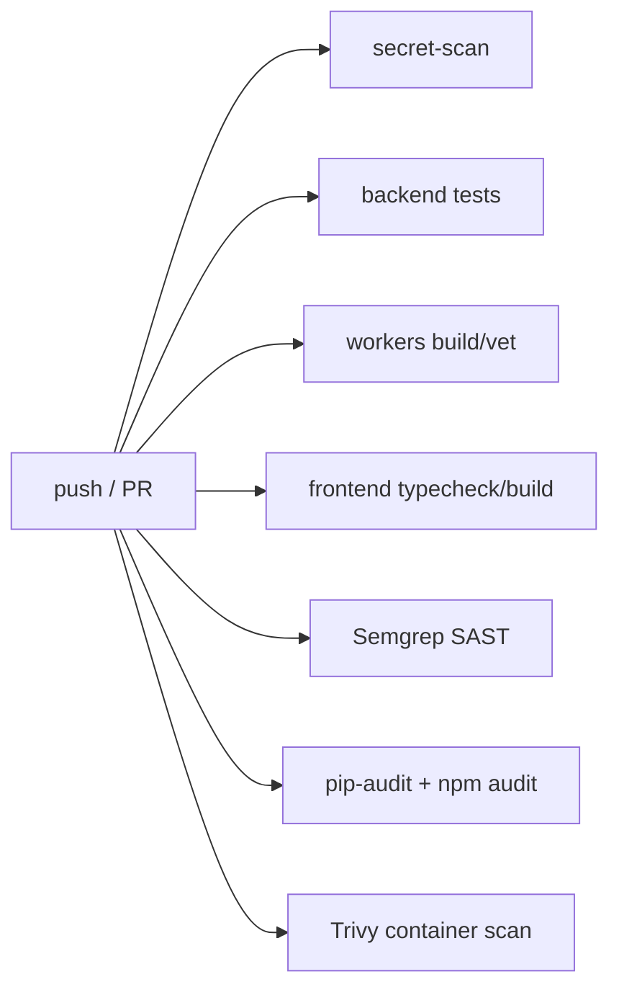
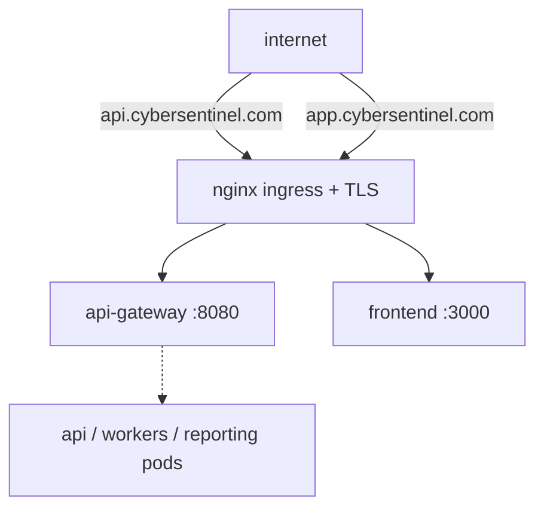

# Infrastructure Guide — Local → Production `[Module: Core-Platform]`

> How CyberSentinel is built, shipped, and run — from a laptop to a cluster. Environments, CI/CD, Kubernetes, Terraform, scaling, secrets, and DR.

**Related:** [Local Setup](../03_local_setup_guide.md) · [Dev Infra view](../01_developer_guide/infra.md) · [API Guide](api_guide.md) · [Architecture Diagrams](../01_developer_guide/architecture_diagram.md)

---

## Table of Contents
1. [Environments](#1-environments)
2. [Local (docker-compose)](#2-local-docker-compose)
3. [CI/CD pipeline](#3-cicd-pipeline)
4. [Kubernetes](#4-kubernetes)
5. [Terraform (AWS)](#5-terraform-aws)
6. [Scaling](#6-scaling)
7. [Secrets management](#7-secrets-management)
8. [Networking, DNS, TLS](#8-networking-dns-tls)
9. [Observability](#9-observability)
10. [Disaster recovery & backups](#10-disaster-recovery--backups)
11. [Known gaps](#11-known-gaps)

---

## 1. Environments

| Env | Where | How it differs |
|---|---|---|
| **Development** | laptop, `docker-compose` / `scripts/dev.sh` | `DEBUG=true`, `DB_AUTO_CREATE` allowed, default creds, no TLS |
| **Staging / Production** | Kubernetes (namespace `cybersentinel`) on AWS (Terraform-provisioned) | Alembic-managed schema, real Supabase, TLS via cert-manager, managed RDS Postgres, secrets from cluster secrets |

CI triggers on `push` to `main`/`develop` and all PRs. `[NEEDS CONFIRMATION FROM DEV]` on the exact staging vs prod branch/deploy mapping — the CI file builds and scans but the **deploy step is not present** in `ci.yml` (see [§11](#11-known-gaps)).

## 2. Local (docker-compose)
Full topology, ports, and `depends_on` health-gates are in [Dev Infra §1](../01_developer_guide/infra.md#1-compose-topology). Eight services: postgres, redis, rabbitmq, api, worker-control-plane, asm-consumer, reporting, frontend. `startup/` holds `setup.sh`, `backend-setup.sh`, `frontend-setup.sh` bootstrap helpers. Commands: [Local Setup Guide](../03_local_setup_guide.md).

## 3. CI/CD pipeline
`.github/workflows/ci.yml` — **security-forward** pipeline. Jobs run in parallel:

| Job | Tooling | Blocking? |
|---|---|---|
| **secret-scan** | gitleaks (full history, `fetch-depth: 0`) | yes |
| **backend** | Python 3.11: `pip install`, `ruff check` (soft), `pytest` (test env vars) | tests blocking, lint soft |
| **workers** | Go 1.24: `go build`, `go vet`, `go test` (soft) | build/vet blocking, test soft |
| **frontend** | Node 20: `npm ci`, `npm run lint` (soft), **`npx tsc --noEmit` (blocking)**, `npm run build` | typecheck + build blocking |
| **sast** | Semgrep (`p/ci p/security-audit p/secrets`) | **blocking** |
| **sca** | `pip-audit` (backend) + `npm audit --audit-level=high` (frontend) | **blocking** |
| **container-scan** | build API image + Trivy (HIGH,CRITICAL, `exit-code 1`) | **blocking** |

> This is a strong security gate (secrets, SAST, SCA, image CVEs all fail the build). There is **no automated deploy job** yet — deployment to the cluster is currently manual / out-of-band. `[NEEDS CONFIRMATION FROM DEV]`

## 4. Kubernetes
`infrastructure/kubernetes/`:
- **`namespace.yaml`** — namespace `cybersentinel`.
- **`ingress.yaml`** — nginx ingress + cert-manager (`letsencrypt-prod`), TLS for `api.cybersentinel.com` (→ `api-gateway:8080`) and `app.cybersentinel.com` (→ `frontend:3000`).
- **`kubernetes/deployment.yaml`** — present but **empty**; workload Deployments/Services are not yet defined here. `[NEEDS CONFIRMATION FROM DEV]`

**To productionize the deploy** ([NEEDS CONFIRMATION FROM DEV] on intended shape): add Deployments + Services for `api`, `worker-control-plane`, `asm-consumer`, `reporting`, `frontend`; a Service named `api-gateway` on 8080; ConfigMaps/Secrets for the env vars in [§7](#7-secrets-management); and HPAs per [§6](#6-scaling).

## 5. Terraform (AWS)
`infrastructure/terraform/` — providers `aws ~>5.0` + `kubernetes ~>2.20`. Provisions:
- **VPC** (`10.0.0.0/16`), Internet Gateway, **2 public + 2 private subnets** across 2 AZs.
- **RDS PostgreSQL 15.4** (`db.t3.micro` default, 20GB, 7-day backups, private subnets, SG allowing 5432 from VPC CIDR only).
- **EKS cluster** — **commented out / placeholder** (requires additional IAM setup). `[NEEDS CONFIRMATION FROM DEV]`

Variables (`variables.tf`): `aws_region` (us-east-1), `vpc_cidr`, `db_instance_class`, `db_username`/`db_password` (sensitive), `environment`. Outputs: `vpc_id`, subnet IDs, `db_endpoint` (sensitive).

> The Postgres engine version differs between Terraform (RDS 15.4) and local compose (`postgres:16-alpine`). Align before prod. `[NEEDS CONFIRMATION FROM DEV]`

## 6. Scaling
- **API:** stateless → scale horizontally behind the ingress. The scheduler is multi-replica-safe (`FOR UPDATE SKIP LOCKED`) so running N API replicas won't double-enqueue scans.
- **Workers:** the `asm-consumer` scales via RabbitMQ competing-consumers (prefetch 16, `JOB_MAX_CONCURRENCY` per instance); the `control-plane` scales per request goroutine. Add replicas to increase scan throughput. Both stateless.
- **Reporting:** scale as competing consumers on `report.asm`.
- **Notification bus:** in-process with the API; scales with API replicas (Redis pub/sub bridges them).
- **Stores:** Postgres = managed RDS (vertical + read replicas); Redis/RabbitMQ = managed or clustered as load grows.

Suggested HPA signals: API on CPU/RPS; consumer on RabbitMQ `jobs.asm` queue depth. `[NEEDS CONFIRMATION FROM DEV]` — no HPA manifests exist yet.

## 7. Secrets management
- **Local:** per-service `.env` files (git-ignored). Compose supplies safe local defaults for infra only.
- **Cluster:** env vars sourced from Kubernetes Secrets/ConfigMaps (mechanism; values never in git). Terraform marks `db_username`/`db_password` sensitive; RDS credentials should flow into a cluster Secret. `[NEEDS CONFIRMATION FROM DEV]` on the exact secret store (K8s Secrets vs external, e.g. AWS Secrets Manager / SOPS).
- **CI:** the `X_INTERNAL_TOKEN` (control-plane auth), `SUPABASE_JWT_SECRET`, and `SUPABASE_WEBHOOK_SECRET` are the critical secrets — never log them. gitleaks + Semgrep secrets rules guard against accidental commits.

Full env-var name list: [Dev Infra §6](../01_developer_guide/infra.md#6-environment-variables-names-only).

## 8. Networking, DNS, TLS
- **DNS:** `api.cybersentinel.com` + `app.cybersentinel.com`.
- **TLS:** cert-manager `letsencrypt-prod` ClusterIssuer, secret `cybersentinel-tls`, terminated at the nginx ingress.
- **Reverse proxy:** frontend served by nginx (`frontend/nginx.conf`); ingress routes host → service.
- **Internal:** the Go control-plane binds `127.0.0.1` when `X_INTERNAL_TOKEN` is unset and requires the token header otherwise — internal calls must never be internet-exposed.

## 9. Observability
- **Logs:** structured, with `correlation_id` on errors.
- **Metrics:** `GET /metrics` (Prometheus text) with dependency-liveness gauges (DB/Redis/RabbitMQ).
- **Health:** `/health` (liveness), `/readyz` (readiness — 503 if DB down) → wire to K8s probes.
- **Optional:** Sentry (`SENTRY_DSN`) and OpenTelemetry (`OTEL_EXPORTER_OTLP_ENDPOINT`). Currently skeleton — no-ops unless configured.

## 10. Disaster recovery & backups
- **Postgres:** RDS automated backups (7-day retention in Terraform); `skip_final_snapshot=true` is set — **change to `false` for prod** so a final snapshot is taken on destroy. `[NEEDS CONFIRMATION FROM DEV]`
- **Redis/RabbitMQ:** treated as reconstructible — pipeline state has TTLs, jobs are re-enqueueable by the scheduler; losing them costs in-flight scans, not durable data.
- **Recovery model:** the source of truth is Postgres; the scan pipeline is idempotent and re-runnable. Restore Postgres, re-point services, and the system converges.

## 11. Known gaps
- **No deploy job** in CI — build/scan only; deployment is manual. `[NEEDS CONFIRMATION FROM DEV]`
- **`kubernetes/deployment.yaml` is empty** — workload manifests not committed.
- **EKS is commented out** in Terraform; the cluster is assumed to exist.
- **No HPA/autoscaling manifests.**
- **Postgres version drift** (RDS 15.4 vs compose 16).
- **`skip_final_snapshot=true`** on RDS — unsafe for prod.
- **Blue/green & rollback strategy undefined** — [NEEDS CONFIRMATION FROM DEV]; recommend rolling updates via K8s Deployments with readiness gates once workload manifests land.
