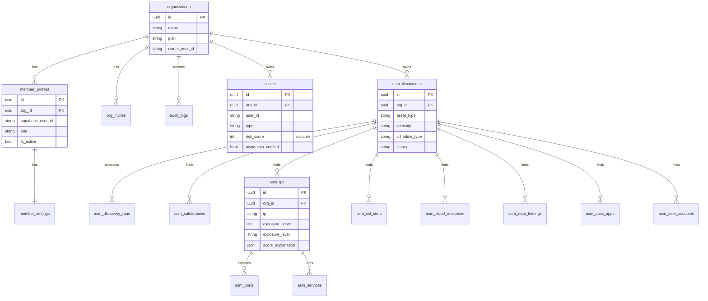
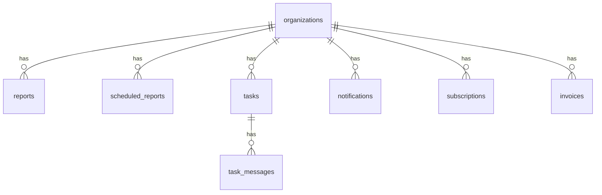
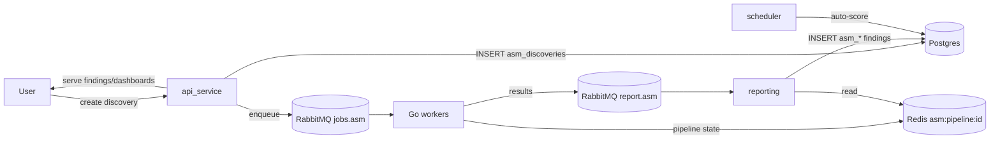

# Database & Data Infrastructure Guide

> Every data store, every table, and how data flows through them. PostgreSQL is the system of record; Redis and RabbitMQ are coordination/transport; ClickHouse is reserved.

**Related:** [Inventory §5](00_inventory.md#5-data-stores) · [API Service](01_developer_guide/api_service.md) · [Reporting](01_developer_guide/reporting.md) · [Glossary](02_glossary_and_panel_guide/domain_glossary.md)

---

## Table of Contents
1. [Store selection rationale](#1-store-selection-rationale)
2. [The tenancy contract](#2-the-tenancy-contract-read-this-first)
3. [PostgreSQL schema](#3-postgresql-schema)
4. [ER diagrams](#4-er-diagrams)
5. [Data flow](#5-data-flow)
6. [Migrations](#6-migrations)
7. [Redis](#7-redis)
8. [RabbitMQ](#8-rabbitmq)
9. [ClickHouse](#9-clickhouse-reserved)
10. [Indexing, retention, growth](#10-indexing-retention-growth)

---

## 1. Store selection rationale

| Store | Chosen for | Why |
|---|---|---|
| **PostgreSQL 16** | System of record — all application data | Relational integrity, transactions, FK cascade for tenant isolation, mature async driver (asyncpg) |
| **Redis 7** | Coordination + realtime | Sub-ms pub/sub for realtime events, TTL'd scratch state for scan pipelines, atomic dedup locks, fixed-window rate limiting |
| **RabbitMQ 3.13** | Durable work transport | At-least-once delivery, manual ACK, dead-lettering, competing consumers — jobs and results must survive crashes |
| **ClickHouse** | *(reserved, unused)* | [INFERRED] intended for write-heavy analytical/time-series data (e.g. exposure history) — not yet wired. `[NEEDS CONFIRMATION FROM DEV]` |

## 2. The tenancy contract (read this first)
**Every application table carries `org_id`** — FK → `organizations.id`, `ON DELETE CASCADE`, nullable only during backfill. This is how multi-tenancy is enforced: every query is scoped by `org_id`, and deleting an org cascades away all its data.

**`user_id` is the Supabase subject *string* — never a foreign key.** Identity lives in Supabase, so a user deletion can *never* cascade-delete org data. This invariant is guaranteed by `tests/test_tenancy.py`. When you add a table, follow this contract or you break tenant isolation.

## 3. PostgreSQL schema

### Tenancy `[Module: Auth]`
| Table | Key columns | Notes |
|---|---|---|
| `organizations` | id, name, plan, owner_user_id, timestamps | Tenant root |
| `member_profiles` | id, org_id, supabase_user_id, email, full_name, role, avatar_url, country, phone, is_active, deleted_at | role ∈ owner/admin/analyst/reader; unique (org_id, supabase_user_id); soft-delete |
| `member_settings` | org_id, user_id, notifications (JSON), preferences (JSON) | per-(org,user) |
| `org_invites` | email, role, token (unique), status, invited_by, expires_at | single-use, 72h TTL |
| `audit_logs` | org_id, actor_user_id, action, target, meta (JSON) | append-only |

### ASM `[Module: ASM]` (16 tables)
| Table | Purpose | Key columns |
|---|---|---|
| `asm_discoveries` | scan job definition | asset_type, target_source, intensity, schedule_type, schedule_value, status, next_run_at, last_run_at |
| `asm_discovery_runs` | one execution of a discovery | status, triggered_by, summary, intensity, duration |
| `asm_subdomains` | discovered subdomains | subdomain, dns/resolved status, parent asset |
| `asm_ips` | discovered IPs (+ enrichment) | ip, geo/ASN/RDAP/cloud attribution, **exposure_score, exposure_level, score_explanation** |
| `asm_ports` | open ports | ip, port, protocol, service, status |
| `asm_services` | fingerprinted services | ip, port, service, version, product |
| `asm_ssl_certs` | TLS certs | host, port, protocol, issuer, validity |
| `asm_api_endpoints` | discovered APIs | url, method, status, type |
| `asm_cloud_resources` | cloud assets | provider, type, resource, access, region |
| `asm_admin_endpoints` | admin/login pages | url, status, type |
| `asm_backup_files` | exposed backup/config files | url, extension, status |
| `asm_changes` | inter-scan diffs | message, change count |
| `asm_repo_findings` | repo secrets/leaks | repo_url, finding_type, rule, file_path, line, severity |
| `asm_saas_apps` | discovered SaaS | application, vendor, category, url, discovery method, status |
| `asm_user_accounts` | breached accounts | email, source, breached, breach_count, exposed_data, severity |
| `asm_settings` | per-user ASM config | thresholds, weights, notification/automation/suppression/grouping (JSON) |

Every ASM table has `org_id` + `asset_id` + per-discovery unique constraints (shared CDN/cloud IPs are recorded *per-discovery*, not globally deduped).

### Assets, Reports, Tasks, Notifications, Billing, Marketing `[Module: Core-Platform]`
| Table | Key columns |
|---|---|
| `assets` | org_id, user_id, name, type, exposure (public/internal), **risk_score (nullable = Unscanned)**, last_scored_at, tags (ARRAY), status, ownership_verified, verification_token |
| `reports` | org_id, module, report_type, format, sections, content (JSONB) |
| `scheduled_reports` | org_id, frequency (daily/weekly/monthly), recipients (ARRAY), next_run_at |
| `tasks` | org_id, title, status, assignee, completed_at |
| `task_messages` | task_id, platform (internal/slack/jira/email), body |
| `notifications` | org_id, user_id, type, payload, read |
| `notification_preferences` | user-unique; email/push/in_app bools |
| `subscriptions` | org_id (keyed by user_id), plan, status |
| `invoices` | org_id, user_id, amount, status |
| `newsletter_leads` | email, source |

### Legacy (deprecated) `[Module: Auth-legacy]`
`companies`, `users` (hashed_password nullable, being dropped), `team_invites`, `team_roles`. Still referenced by `billing.py` / `services.py`. Being retired — see [migration note](01_developer_guide/overview.md#5-the-active-migration-you-must-know-about). **Do not build new features on these.**

## 4. ER diagrams

### Tenancy + Assets + ASM core

### Platform tables

## 5. Data flow

- **Origination:** `api_service` writes `asm_discoveries`, `assets`, tenancy, reports, tasks, notifications.
- **Findings:** written *only* by the `reporting` consumer (shares SQLAlchemy models with the API). `asm_ips.exposure_score` originates in the Go worker's `exposure_scoring` step; the API's [Python exposure model](01_developer_guide/api_service.md#8-scoring--the-exposure-model) also computes scores for rescore / `/asm/exposure`.
- **Reads:** the API serves everything back to the UI, scoped by `org_id`.

## 6. Migrations
**Alembic** (`backend/api_service/migrations/`, async `env.py` importing all model modules so autogenerate won't drop tables; `compare_type` + `compare_server_default` on). Apply with `make migrate` (`alembic upgrade head`). `DB_AUTO_CREATE=true` runs `create_all` at startup — **dev only**; Alembic owns prod DDL.

Migration history (chronological intent):
`initial` → `notifications` → `reports_tables` → `tasks_tables` → `org_scope_and_perf_indexes` (tenancy `org_id` + indexes) → `drop_user_fks` (remove user FKs per the tenancy contract) → `assets_ownership_verification` → `assets_risk_nullable` (NULL = Unscanned) → `asm_unique_per_discovery` (per-discovery uniqueness) → `asm_user_repo_saas_tables` (repo/saas/user asset types).

Helpers: `make stamp` (baseline an existing DB), `make backfill` (`scripts/backfill_org_id.py` — populate `org_id` on legacy rows).

## 7. Redis
| Key / channel | Written by | Read by | TTL | Purpose |
|---|---|---|---|---|
| `asm:pipeline:{job_id}` | Go control-plane | reporting, worker | 24h | pipeline definition + per-step state |
| `asm:worker:events` (pub/sub) | Go control-plane | worker_bridge | — | scan lifecycle → notifications |
| `rt:events` (pub/sub) | notificationservice | run_subscriber (all replicas) | — | cross-replica realtime |
| `worker:{event_id}` | notificationservice | notificationservice | 1800s | once-only dispatch dedup |
| rate-limit windows | api_service | api_service | window | per-IP throttling |

## 8. RabbitMQ
| Queue | Producer | Consumer | Delivery | Notes |
|---|---|---|---|---|
| `jobs.asm` | api_service / scheduler | Go asm-consumer | manual ACK, prefetch 16 | ACK-after-success; `Nack(requeue=false)` → DLQ |
| `report.asm` | Go control-plane | reporting | — | fatal dependency at control-plane boot |

⚠️ **DLQ footgun:** an existing queue declared without dead-letter args cannot be re-declared with them (`PRECONDITION_FAILED`) — first DLQ rollout requires draining/deleting the old queues. See [Workers §11](01_developer_guide/workers.md#11-known-limitations--tech-debt).

## 9. ClickHouse (reserved)
Drivers (`clickhouse-driver`, `clickhouse_connect`) are installed and a connection is closed on shutdown, but **no code reads or writes it**. Intended use is unconfirmed — likely time-series/analytical data such as exposure history. `[NEEDS CONFIRMATION FROM DEV]`

## 10. Indexing, retention, growth

| Concern | Current state | Recommendation |
|---|---|---|
| **Indexes** | `org_scope_and_perf_indexes` migration added org-scope + perf indexes | Ensure every list endpoint's `(org_id, sort_by)` is covered; verify `asm_ips`/`asm_ports` (highest-cardinality) indexes |
| **Growth** | ASM finding tables (`asm_ports`, `asm_ips`, `asm_services`) grow per-scan, per-discovery — the highest-volume tables | Partition by `org_id`/time or archive old runs as scan frequency rises |
| **Retention** | No automatic purge of old `asm_discovery_runs`/findings observed | Define a retention/archival policy; ASM Settings offers "auto-archive stale >30d" at the app level `[NEEDS CONFIRMATION FROM DEV]` |
| **Exposure history** | Not persisted (trend chart shows empty state) | Persist point-in-time snapshots (candidate ClickHouse use) to power trends |
| **Backups** | RDS automated backups (7-day) | Set `skip_final_snapshot=false` for prod; test restores |

*Adding a new module's tables? Add them here with a sub-ER-diagram, keep the `org_id` FK cascade contract, and add indexes for their list queries.*
